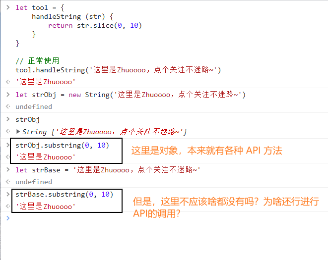
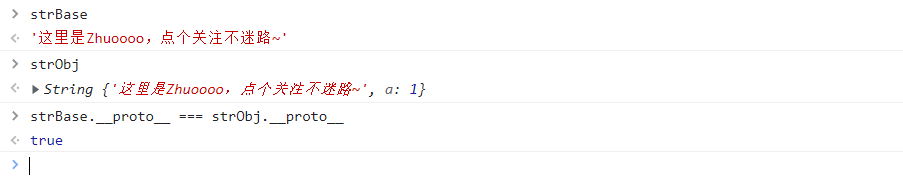

# string 基本类型为啥能直接调用方法

> 这里是突然勤奋的 Zhuo，持续更新文档中。

## 起因

昨天在控制台上调试代码的时候，看到这样一串代码。

```js
let tool = {
    handleString (str) {
        return str.slice(0, 10)
    }
}

// 正常使用
tool.handleString('这里是Zhuoooo，点个关注不迷路~')
```



这个时候，我突然产生了一个疑问，`tool.handleString` 中的 `tool` 是一个对象，它才可以用 `.` 运算符去进行一个方法调用。但是，`str` 它是一个基本类型，为啥也能这么去使用？而且一直以来也都是这么使用，直接通过字面量定义属性类型，也没有说过需要使用 `new` 关键字的方式呀。小小的脑袋装着大大的疑惑：难道它也变成 `String` 对象了？


事实上，它也确实是变成了 `String` 对象。



这样的行为也是为了使用时候更加方便。（想一想，每次使用的时候都要先 `new` 一下，然后获取值的时候又调用一下 `valueOf`  /  `toString` 也是挺麻烦的。）那么，语言表现出来的特性，和我逻辑上思考的行为不太一致，说明它在背后自己进行了某些操作。

它在输出的时候是字符串，但是在使用了 `.` 运算符的情况下却拥有了对象的行为。那么，它有可能是在运行时，隐性地实例化了一个 `String` 对象来代替这一部分的计算，将计算的结果返回，最后再销毁对象。

## bug？不，feature！

后来，我在《JavaScript高级程序语言设计（第四版）》中找到了完整的答案，见 **5.3 原始值包装类型** （第113页）。

原文内容：

> 为了方便操作原始值，`ECMAScript` 提供了3 种特殊的引用类型：Boolean、Number 和String。这些类型具有本章介绍的其他引用类型一样的特点，但也具有与各自原始类型对应的特殊行为。**每当用到某个原始值的方法或属性时，后台都会创建一个相应原始包装类型的对象，从而暴露出操作原始值的各种方法。**来看下面的例子：
>
> ```js
> let s1 = "some text";
> let s2 = s1.substring(2);
> ```
>
> 在这里，`s1` 是一个包含字符串的变量，它是一个原始值。第二行紧接着在`s1` 上调用了`substring()`方法，并把结果保存在`s2` 中。我们知道，原始值本身不是对象，因此逻辑上不应该有方法。而实际上这个例子又确实按照预期运行了。这是因为后台进行了很多处理，从而实现了上述操作。具体来说，当第二行访问`s1` 时，是以读模式访问的，也就是要从内存中读取变量保存的值。在以读模式访问字符串值的任何时候，后台都会执行以下3 步：
>
> 1. **创建一个String 类型的实例；**
> 2. **调用实例上的特定方法；**
> 3. **销毁实例。**
>
> 可以把这3 步想象成执行了如下3 行`ECMAScript` 代码：
>
> ```js
> let s1 = new String("some text");
> let s2 = s1.substring(2);
> s1 = null;
> ```
>
> 这种行为可以让原始值拥有对象的行为。对布尔值和数值而言，以上3 步也会在后台发生，只不过使用的是`Boolean` 和`Number` 包装类型而已。引用类型与原始值包装类型的主要区别在于对象的生命周期。在通过`new` 实例化引用类型后，得到的实例会在离开作用域时被销毁，而自动创建的原始值包装对象则只存在于访问它的那行代码执行期间。这意味着不能在运行时给原始值添加属性和方法。比如下面的例子：
>
> ```js
> let s1 = "some text";
> s1.color = "red";
> console.log(s1.color); // undefined
> ```
>
> 这里的第二行代码尝试给字符串`s1` 添加了一个`color` 属性。可是，第三行代码访问`color` 属性时，它却不见了。原因就是第二行代码运行时会临时创建一个`String` 对象，而当第三行代码执行时，这个对象已经被销毁了。实际上，第三行代码在这里创建了自己的`String` 对象，但这个对象没有`color` 属性。可以显式地使用`Boolean、Number 和String` 构造函数创建原始值包装对象。不过应该在确实必要时再这么做，否则容易让开发者疑惑，分不清它们到底是原始值还是引用值。在原始值包装类型的实例上调用`typeof` 会返回`"object"`，所有原始值包装对象都会转换为布尔值`true`。另外，`Object` 构造函数作为一个工厂方法，能够根据传入值的类型返回相应原始值包装类型的实例。比如：
>
> ```js
> let obj = new Object("some text");
> console.log(obj instanceof String); // true
> ```
>
> 如果传给`Object` 的是字符串，则会创建一个`String` 的实例。如果是数值，则会创建`Number` 的实例。布尔值则会得到`Boolean` 的实例。**注意，使用new 调用原始值包装类型的构造函数，与调用同名的转型函数并不一样。**例如：
>
> ```js
> let value = "25";
> let number = Number(value); // 转型函数
> console.log(typeof number); // "number"
> let obj = new Number(value); // 构造函数
> console.log(typeof obj); // "object"
> ```
>
> 在这个例子中，变量`number` 中保存的是一个值为25 的原始数值，而变量obj 中保存的是一个`Number` 的实例。虽然不推荐显式创建原始值包装类型的实例，但它们对于操作原始值的功能是很重要的。每个原始值包装类型都有相应的一套方法来方便数据操作。

## 最后

这个小知识，可能对实际编码没有啥太大的用处，笔者也是觉得有意思才想着总结一下的。如果觉得有趣，不妨点个赞。谢谢~
