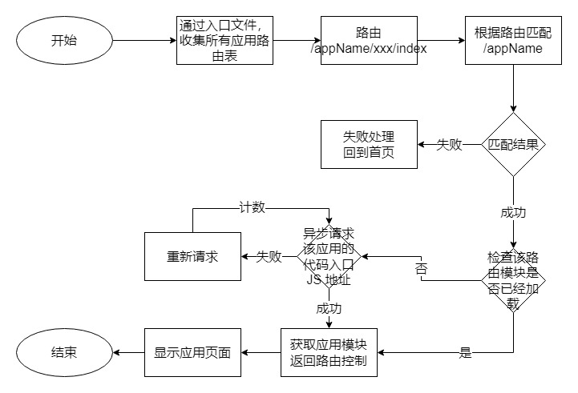
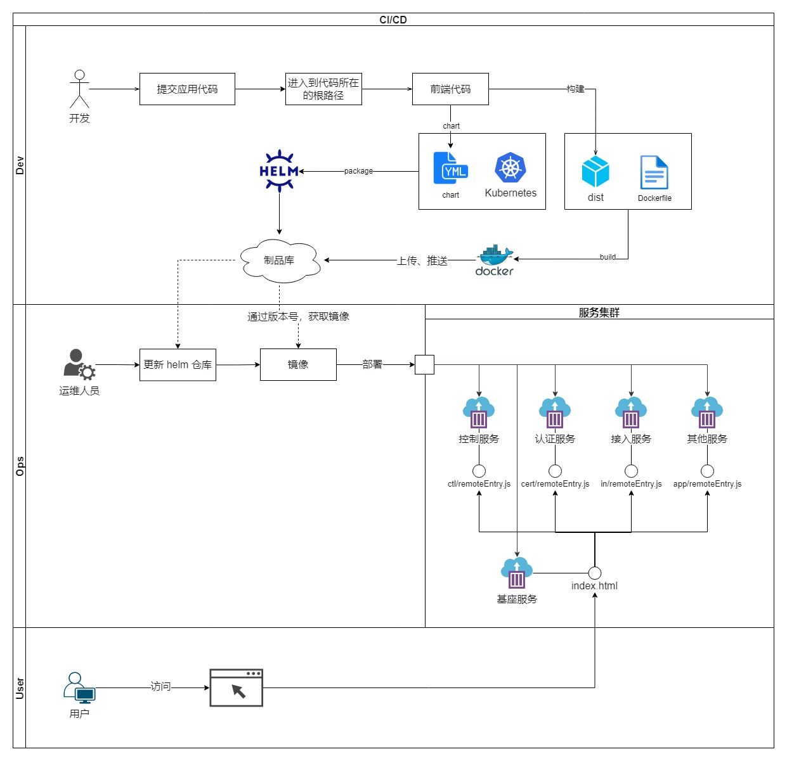

# 全面敏捷模式下的微服务方案

> 更新计划

本文只涉及到  `module-federation` 微前端方案的设计层面分享，关于具体实现，可以参考写的[简单例子](https://github.com/zhuoooo/microservices)；所有的[设计图](https://github.com/zhuoooo/design-diagram/blob/main/%E5%BE%AE%E6%9C%8D%E5%8A%A1%E8%AE%BE%E8%AE%A1%E5%9B%BE.drawio)自取，如果对你有一些启发，请点个 star。

## 背景

团队从瀑布流模式转变为敏捷模式，将整个项目团队划分为多个小组并行开发，多小组同时升级的分支处理和代码冲突之类的问题频繁出现。于是为了团队转型成功，前端的架构也需要进行升级以满足团队需求。

目前，我们开发和维护代码的现状：


- 一个仓库包含了所有的业务组的前端代码
- 只能一起打包出一个整包，也无法单独部署
- 后端已完成微服务的拆分

如上所述，虽然一般场景通过 git 多分支管理能解决【独立开发】和【发布】的问题，但是一遇到【多团队同时发布】的场景就让人头疼了：

- 需要拉上各个团队的负责人，反复确认当天能否正常上线
- 上线分支排列组合（release-a、release-b、release-ab ）预防某一个团队突发问题不上线
- 测试工作量增加：原本只要验收一个代码包，现在还要验证多个代码包功能（> 1）

看一眼分支模型：


既然提出了已有问题，为了解决这些问题，我们意识到和后端一样将整个项目拆分成若干的子应用，将它们也变成微服务，不就可以解决目前的困境了吗？自然而然我们就想到了“微前端”的概念。有目标，就好发力了，我们参考了业务优秀方案，同时结合了自身实际情况，最终决定用`webpack5 module federation `特性来进行微前端的实践与落地。

## 需求分析

### 外部需求

1. 拆分解耦特性团队的代码，解决上线分支治理问题
2. 代码自治：微前端代码架构按照特性拆分，完成代码自治
3. 单独打包，独立部署
4. 不影响现在的用户体验

### 内部需求

1. 不影响开发体验
2. 方案对原业务代码侵入性最低
3. 学习成本低
4. 统一技术栈
5. 子应用做到插拔，多应用自由组合部署、发布
6. 配合 `Docker + Kubernetes`，做到所有应用的可以滚动部署，上线无感知
7. 前端灰度发布


## 方案选择

方案：

1. 应用微服务化，诸如 qiankun2
   - 存在性能问题，且沙箱逃逸问题难解决，放弃
2. 微件化：通过组合多个独立应用、组件来构建一个单体应用，例如 Module Federation
   - 在接入第三方应用上存在的问题比较大，但是对于我们想要达到【独立升级】的效果来说，此短板可以接受
3. 结合 Web Components 构建，例如 micro-app
   - 在处理沙箱的性能问题和逃逸问题上虽然比方案1更优秀，但这两个问题出现还是难解决，且目前官方维护的频率及未有稳定版本，放弃
4. MPA+路由分发
   - 相当将原本的一个系统拆成多个系统，体验上无法接受，放弃
5. MPA + iframe
   -  iframe 在性能和用户体验上的问题也是无法接受，放弃
6. 纯 Web Component 进行构建应用
   - 需要用一个新的基础方案将整个项目的代码重构，工作量上无法接受，放弃

最终采用方案2：`module federation`。


## 微前端实践

### 组件设计

通过方案的分析以及项目实际情况的梳理，我们确定了微前端的整体方案，输出组件图，如下图所示：


可以看到，整个方案非常简单：按照开发小组进行路由级别的拆分，整个系统可分为两个部分：

- 基座应用：用于管理子应用的路由切换、注册子应用的路由和全局 Store 层、提供全局库和复用层
- 子应用：用于开发子应用业务代码，一个子应用对应一个开发小组，并且管理自己的路由、语言包、埋点、Store

基座应用和子应用联系起来的桥梁则是**入口文件：`remoteEntry.js`**。这可以让基座应用准确地发现子应用资源的路径从而进行加载。

因为依赖了`remoteEntry.js`进行关联，所以这个文件不会加 hash 后缀，这就要求对该命名的文件全部**设置协商缓存，不再是强缓存**。

### 动态化方案

首先，我们需要路由的管理方案，使得子应用之间有能力互通切换。其次，我们需要 `Store` 层的方案，让子应用有能力使用全局 `Store`。并且，我们还需要 `CSS` 的加载方案，来加载子应用的样式布局。下面来详细说明这三个方案。

#### 动态路由

动态路由方案是想要进行路由级别的拆分，首先我们要确定用什么来管理路由？

很多实现方案倾向于使用特制路由来管理模块。例如开源框架 Single-Spa，实现了自己的一套路由监听来切换子应用，并且需要子应用实现特定的注册、挂载、卸载等接口来完成子应用和基座应用的动态对接，还需要特定的模块管理系统，例如 `systemjs` 来辅助完成这一过程。毋庸置疑，这对我们原有项目的改造成本很大，还需要添加额外库，进而造 成包体积大小上的开销。并且子应用的开发者需要熟悉这些特定的接口，学习成本也比较高。显然，这对于我们的业务场景和需求来说很不划算。
那么，我们选择什么来做路由管理呢？最终我们使用了 `Vue-Router`，这样能够保持我们原来的技术栈不变，同时对于应用的侵入也是最低，几乎可以忽略不计。此外，`Vue-Router` 能完全可以满足我们的需求，而且自动会帮助我们管理页面的加载与卸载，而不是每次切换路由都重新初始化整个子应用，所以在加载速度体验上也是最优的，跟单页应用体验一致。
实现上也很简单，如下图：



上面这个流程图，展示了我们在基座应用中切换到子应用路由时，加载子应用并进行展示的过程。这里的重点步骤是加载子应用入口文件，并动态注册子应用路由的过程。我们使用的是 `Vue-Router`，所以使用其提供的动态能力`addRoutes`来完成。


#### 动态 Store

对于 `Store` 层，我们项目使用的是 `Vuex`，子应用通过动态注册进来天然就可以访问到全局 `Store`，所以对于 `Store` 的访问能够自动支持。 那么，如果子应用程想要注册自己的全局 `Store` 该怎么办呢？与路由一样，子应用声明自己的 `Store`，基座会根据子应用的 `namespace` 注册到全局的 `Store` 中。

从下图中可以看到，支持动态 `Store` 也是花费很小的改造成本就可以完成。


#### CSS 作用域

项目中使用了 `style scoped` 的特性，所以在业务部分的样式其实问题不大；主要会产生样式冲突的地方，还是全局样式。

1. 规范上，严格按照`BEM`格式命名
2. 统一全局样式 `reset.css`
3. 工具上，通过 `PostCSS `插件在编译子应用时，按照分配给子工程的唯一业务线标识 `.namespace`，为 每一组 `CSS` 规则生成了命名空间来解决这个问题；配合上路由切换时，在 `body` 上动态切换 `.namespace` 可以保证样式只在对应的子应用中生效

```js
module.exports = () => ({
    plugins: [
        [
            "postcss-prefix-selector",
            {
                prefix: '.app-name',
                transform(prefix, selector, prefixedSelector, filepath) {
                    if (selector.match(/^(html|body)/)) {
                        return selector.replace(/^([^\s]*)/, `$1 ${prefix}`);
                    }
                    if (filepath.match(/node_modules/)) {
                        return selector;
                    }
                    return prefixedSelector;
                },
            }
        ],
        require('autoprefixer'),
    ]
});
```

完成以上三个方案的改造之后，子应用就拥有了动态接入的能力了。

### 子应用接入

在动态加载方案确定之后，基座应用怎么才能知道子应用的资源路径，进而加载对应的 JS 和 CSS 资源呢？

#### 基座应用初始化

我们有一组映射信息（下方代码块）。 特性团队唯一标识为 `AppName`，相应的子应用入口静态资源地址为 `chunk`。这样的话，当基座引用就可以拉取这个配置信息完成**子应用的接入**，在路由切换时准确地找到对应的子应用，进而进行后续的资源加载过程。

```js
[
    {
        name: 'dc',
        chunk: '/dc/remoteEntry.js'
    },
    {
        name: 'security',
        chunk: '/security/remoteEntry.js'
    }
    // ...
]
```

#### 子应用接口

子应用需要暴露它要注册给基座应用的对象，来进行基座应用加载子应用的过程。在子应用入口文件中定义 `bootstrap` 来传递注册的对象，主要代码如下：

```js
// 暴露给基座的子应用入口
export async function bootstrap() {
    await getLangPkg(); // 加载语言包

    routes.forEach(item => {
        if (!item.meta.app) {
            item.meta.app = appName;
        }
    });

    return {
        name: 'dcApp',
        routes,
        storeModule: {
            Export,
            BehaviorExport
        }
    };
}
```

这里暴露了子应用的两个内容供基座实现调用：

1. routes：路由表
2. store：vuex 实例

### 开发流程

整个微服务方案是基于 `Module Federation` 实现的，所以在开发上，我们的开发体验和开发单页应用的体验一致，也支持热更新，无需做任何配置和额外学习成本，就可以像开发 `Vue` 应用一样进行开发。每个特性小组的开发者，只需要跑 基座 + 特定的子应用 就可以进行业务开发了。

## 微前端下的架构变化

在整个方案的改造之后，我们的项目整体的架构变成了如下图展示的样子：


前端侧的代码按照小组特性拆分成若干个子应用：

- 每个子应用只拥有自己相关的代码，基座应用可以看成比较特殊的子应用，它提供工程能力，最好不要有业务代码
- 将应用代码划分到 `packages/apps`文件下， 通过 `monorepo + pnpm` 进行管理依赖
- 所有的文件夹进行单独的打包构建，搭配  `Docker + Kubernetes` 构建成单独的容器（红色部分内所有的子应用都是单独的容器）变成真正的微服务
- 通过 `ingressroute + nginx` 加载不同容器之间的子应用资源

以上的变化，让拆分出来的子应用能够独立开发 - 维护 - 发布之外，还使得我们前端应用升级时的 灰度 - 部署 - 回滚 操作变得更加简单、快速。

## 部署方案

在达成独立部署上线的目标之后，所有的子应用都是独立的，发布不需要依赖于任何应用。只需要确认开发修改了哪些子应用的代码，那么就升级对应的子应用即可。



具体流程：

1. 开发修改了 A 应用的代码，上库
2. 打包平台（千流，公司自建）识别到具体变更的代码路径，对 A 应用进行打包，生成镜像容器、版本号等，推送到镜像平台
3. 升级对应服务

虽然步骤是这些，但是在开发人员这里，他只需要提供本次升级的版本号（1.0.xxx）即可，背后流程不需要深入了解。


## 回滚方案

得益于 `Docker + Kubernets` ，前端的回滚只需要执行一条 `helm` 命令即可。除此没有其他的内容。

```shell
helm rollback platform
```


## 总结

总的来说，我们完成了以下的目标：

- [x] 代码拆分解耦
- [x] 单独打包，独立部署
- [x] 不影响现在的用户体验：没有引入其他类库，也没有使用 iframe
- [x] 不影响开发体验：支持热更新
- [x] 方案对原业务代码侵入性最低：核心工作量在代码拆分，webpack的配置并没有多少工作量
- [x] 学习成本低：基本没有学习成本
- [x] 统一技术栈：本来就是一个项目
- [x] 前端灰度发布


## 学习链接

感谢以下文章的作者/团队分享的文章，提供了很好的思路。

1. [Module federation 原理研究](https://blog.towavephone.com/module-federation-principle-research/)
2. [Revolutionizing Micro Frontends with Webpack 5, Module Federation and Bit](https://blog.bitsrc.io/revolutionizing-micro-frontends-with-webpack-5-module-federation-and-bit-99ff81ceb0)
3. [How to Build a Micro Frontend with Webpack's Module Federation Plugin](https://dev.to/bitovi/how-to-build-a-micro-frontend-with-webpacks-module-federation-plugin-n41)
4. [Webpack Module Federation](https://webpack.docschina.org/concepts/module-federation/)
5. [Module Federation Examples](https://github.com/module-federation/module-federation-examples)
6. https://medium.com/@A__G__B/introducing-fmr-federated-module-reloading-820ec56256db
7. [EMP-面向未来微前端方案正式开源了！](https://juejin.cn/post/6891532248269783054)
8. [micro-app 介绍](https://github.com/micro-zoe/micro-app/issues/8)
9. [可能是你见过最完善的微前端解决方案](https://zhuanlan.zhihu.com/p/78362028)
10. [字节跳动是如何落地微前端的](https://juejin.cn/post/7016900744695513125)
11. [微前端在美团外卖的实践](https://tech.meituan.com/2020/02/27/meituan-waimai-micro-frontends-practice.html)
