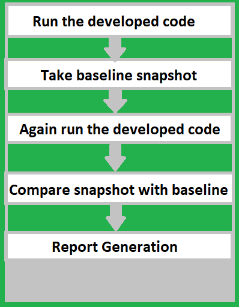

# 软件测试 —— 视觉测试

视觉测试（Visual Testing），它验证了所开发的软件用户界面（ UI ）是否与用户的视图兼容。它确保开发的网页设计正确遵循 UI 元素的空间、大小、形状和位置。它还确保这些元素在各种设备和浏览器上正常工作。视觉测试验证了多种设备、浏览器、操作系统等是如何影响软件的。

**视觉测试的特点**：

- 交付一个一致的用户界面。
- 快速和响应的测试。
- 连续的可视化回归测试。
- 在每次提交时进行测试。
- 不需要测试脚本。

本文重点讨论了以下主题：

1. 视觉检测系统。
2. 视觉检测的工作。
3. 为什么要进行视觉测试？
4. 为什么单元测试不能涵盖视觉测试？
5. 视觉测试方法。
6. 视觉测试的类型。
7. 自动化视觉测试的工具。
8. 视觉测试的优势。
9. 视觉测试的劣势。

让我们开始详细讨论这些主题中的每一个。

### 视觉检测系统

自动视觉检测或视觉检测是分析产品的过程，以便对产品质量进行全面控制。在这里，软件是用图像捕捉算法开发的，它捕捉图像以检查产品的质量，这与客户或业务团队提到的我们的要求相一致。它减少了人工操作，并提供了页面对比的最佳结果；检查产品的速度和效率都很高；一定程度上保证了产品页面的稳定性。

### 视觉测试的工作

视觉测试生成、比较和分析浏览器快照，以检测是否有任何像素变化。这些像素的差异被称为视觉像素。

**视觉测试的步骤：**

1. 质量分析员或测试员运行开发的代码，测试应用程序的用户界面。
2. 最初，它将把屏幕记录为快照。它作为一个基线，进一步的测试结果将与之比较。
3. 之后，质量保证部门在后台运行代码，它将拍摄或记录这些运行代码的快照。
4. 接着，它将开始与基线快照进行比较。
5. 如果在这些快照中发现变化，那么测试将被标记为失败。
6. 如果没有发现任何变化，那么它将被标记为成功。

一些可视化测试工具会生成报告，报告中展示捕捉到快照中的差异。它提供使用者发现快照实际上在哪里出现了差异。

- 如果这些图像差异是由错误引起的，开发人员可以修复它们并返回测试、检查
- 修复是否真的有效。如果差异是由用户界面的后续变化引起的，开发人员将不得不审查屏幕截图并更新基线图像，以便将来可以运行视觉测试。

### 为什么要进行视觉测试

做视觉测试是因为视觉错误比人们可能意识到的功能错误更经常发生。做视觉测试的一些原因有：

- 它验证或确保所开发的产品的用户界面与用户的预期一致。
- 它有助于评估 UI 界面的缺陷。
- 它能正确地检测出与基线快照不相关的用户界面的变化。
- 它有助于创建专门的视觉测试案例并涵盖功能点。
- 视觉测试允许测试人员或质量分析师对测试用例进行视觉评估。

### 为什么单元测试不能涵盖视觉测试

视觉 bug 是渲染问题。单元测试工具不会关注渲染效果，它只测量功能行为。在拥有单元测试的情况下，即使网站的界面混乱，单元测试仍能正常工作并且通过测试，但实际上用户界面已经出现了问题。

例如：当创建一个网站时，提交按钮被放置在中心位置，但在后续维护过程中，如果它被错误地移动到浏览器页面的右侧，那么在单元测试中，它将不会捕捉或发现提交按钮被错误放置的异常。因为它检查的是提交按钮的功能是否正常工作，而没有检测位置是否正确。
在视觉测试实施的情况下，它将各种快照与基线快照进行比较，并将检测出提交按钮放置错误的缺陷。它可以帮助测试人员用最少的测试运行找到缺陷。

### 视觉测试方法

以下是视觉测试的一些方法：

1. 创建专门的视觉测试。在这里，测试人员将为不同的场景编写测试案例。在这里，只需要适度地编写测试用例。从头开始写测试用例是很重要的，它需要一些重要的时间来写准确的测试用例。
2. 在现有的单元测试中插入视觉点。在这种方法中，验证应用程序功能的测试已经存在，只是需要在这些测试之间添加一些视觉检查来验证页面。当然，这种方法限制了你的测试覆盖率，但这是一种快速插入视觉测试的方法，并从现有的单元测试代码中获取利益。
3. 在现有的测试框架中插入隐式视觉验证。这种方法非常容易实现，因为它只需要几行代码。然而，它有一个局限性，即在这种情况下，人们也可以进行通用验证。人们不能验证框架中的特定组件。

### 视觉测试的类型

以下是两种类型的视觉测试：

#### 手动视觉测试

在手动视觉测试中，测试人员将手动检查网页上的布局和用户界面元素。在这里，测试人员必须手动拍摄快照或屏幕截图，将这些快照与基线快照进行比较，以发现差异并向团队确认。

另一种有效的手工测试方法是使用组件探索器。在这里，你这个测试人员定义测试状态，使用资源管理器选择一个状态和组件，并在屏幕上检查它。一个这样的工具是 React Storybook，人们可以在那里孤立地开发 UI 组件。通过这种方法，测试人员可以对一个组件进行手动测试，检查它是如何渲染的，并查看它是否工作正常。

**手动测试的步骤：**

浏览应用程序，捕捉已知的好的基线截图。
稍后，从应用程序的最新版本中再截取一组屏幕截图。
手动比较这些屏幕截图（基线与当前），以找出视觉错误。

#### 自动视觉测试

自动视觉测试是一种自动验证用户界面在视觉上是否达到预期效果的方法。自动化视觉测试的好处是，它们提供长期的成本效益，这些比人工测试更快，更准确，因为它们可以排除人为错误，并提供像素级的视觉测试，它们是可重复使用和透明的，因为它们提供自动报告，团队中的任何人都可以方便地随时访问。

在自动化测试中，除非有屏幕截图测试，否则范围会比较窄。另外，由于组织需要时间来学习自动化测试工具，所以有一个陡峭的学习曲线。
如果你需要进行回归视觉测试来处理稳定的用户界面上发生的频繁变化，使用自动化将是一个不错的选择。自动化测试也有助于进行伟大的视觉截图比较。
自动屏幕截图比较在视觉测试中提供了很大程度的精确性，并增加了投资回报率。
自动屏幕截图比较可以捕捉到那些用人眼和人工比较无法发现的错误。它对复杂的用户故事的端到端测试也有帮助。

### 自动化视觉测试的工具

用于自动化视觉测试的工具：[Github](https://github.com/mojoaxel/awesome-regression-testing)

### 视觉测试的优势

1. 提高代码和 UI 界面的质量。
2. 快速的错误检测。
3. 控制不同设备和浏览器上的视图。
4. 易于实现。
5. 快速实施。
6. 自动化。
7. 减少代码。
8. 测试过程中有效的结果反馈。

### 视觉测试的劣势

1. 它不能检测较小的缺陷。
2. 它需要最低限度的技能来实现。这对初学者来说有点困难。
3. 有时，视频记录不是那么清晰。
4. 即使已经实施了测试，也有可能包含检测。
5. 只能测试可见的页面。
