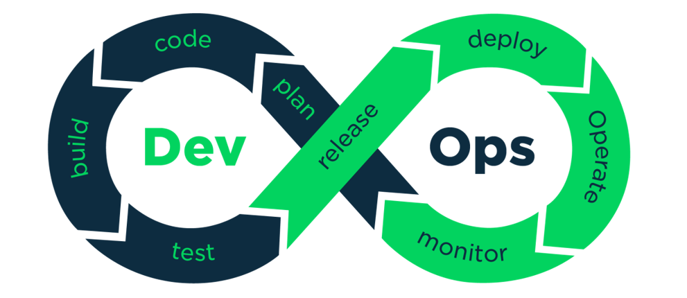

# 《前端基建》——交付形式变化



最初是**瀑布模型**，后来是**敏捷开发**，现在是**DevOps**，这是现代开发人员构建出色的产品的技术路线。随着DevOps的兴起，出现了**持续集成（Continuous Integration）**、**持续交付（Continuous Delivery）** 、**持续部署（Continuous Deployment）** 的新方法。传统的软件开发和交付方法正在迅速变得过时。从历史上看，在敏捷时代，大多数公司会每月，每季度，每两年甚至每年发布部署/发布软件。现如今，在DevOps时代，每周，每天，甚至每天多次是常态。当PaaS正在占领世界时，尤其如此，您可以轻松地动态更新应用程序，而无需强迫客户下载新组件。

**持续集成（CI）**的重点是将各个开发人员的工作集合到一个代码仓库中。通常，每天都要进行几次，主要目的是尽早发现集成错误，使团队更加紧密结合，更好地协作。
**持续交付（CD）**的目的是最小化部署或释放过程中固有的摩擦。它的实现通常能够将构建部署的每个步骤自动化，以便任何时刻能够安全地完成代码发布（理想情况下）。
**持续部署（CD）**是一种更高程度的自动化，无论何时对代码进行重大更改，都会自动进行构建/部署。这些阶段中的每一个都是交付管道的一部分 。

### 看前端

我们之间交付的产物大多是以 `webpack` 构建之后的产物 `dist  ` 包（包含`HTML`、`JS`、`CSS`、附件等）传递给测试，他们拿着这个包再到服务器上进行资源替换。

在这个过程，虽然我们做到各个环节实现自动化：`gitlab` 上执行 `CI` 构建产物，通过 `shell` 脚本自动化上传产物到目标服务器并进行一个资源替换和备份；但是只要资源是存放在虚拟机上的某个目录下，就意味着容易修改。于是，我们经常遇到各种问题：

1. 前端包的版本是多少
2. 谁又手动去服务器上替换前端包了，怎么不走 `CI/CD` 流程
3. 前端开发帮忙看看这个包版本是否为最新
4. ...

于是，我们在产品线进行 `XaaS` 转型期间，也将前端作为一个单独容器服务进行维护。


### 前端交付产物的完整流程

1. 将前端代码通过打包，获得一个 `dist` 包
2. 创建一个 Dockerfile，其中包含构建镜像所需的指令
3. 将新建的镜像作为容器运行

### 什么是 Docker

> Docker is an open platform for developing, shipping, and running applications. Docker enables you to separate your applications from your infrastructure so you can deliver software quickly. With Docker, you can manage your infrastructure in the same ways you manage your applications. By taking advantage of Docker’s methodologies for shipping, testing, and deploying code quickly, you can significantly reduce the delay between writing code and running it in production.

Docker 是一个用于**开发**、**运输**和**运行应用程序**的开放平台。它能够将应用程序与基础设施分开，这样我们就可以快速交付软件。有了 Docker，我们可以用管理应用程序的方式来管理你的基础设施。利用 Docker 快速运输、测试和部署代码的特点，我们可以大大减少将本地编写代码部署生产环境并运行的时间。

### 什么是镜像

镜像是一个只读的模板，带有创建Docker容器的说明。通常情况下，一个镜像是基于另一个镜像的，再进行了一些额外的定制。例如，你可以建立一个基于`ubuntu`镜像的镜像，但会安装Apache网络服务器和你的应用程序，以及其他所需的配置细节。

你可以创建自己的镜像，也可以只使用那些由他人创建并发布在源上的镜像。要构建自己的镜像，需要使用简单的语法创建一个 Dockerfile，用于定义创建和运行镜像所需的步骤。Dockerfile中的每个指令都会在镜像中创建一个层。当你改变Dockerfile重建镜像时，仅重建那些已更改的层。与其他虚拟化技术相比，这是使镜像如此轻便、小巧和快速的部分原因。

### 什么是容器

容器是一个镜像的可运行实例。你可以使用Docker API或CLI来创建、启动、停止、移动或删除一个容器。你可以将一个容器连接到一个或多个网络，为其附加存储，甚至可以根据其当前状态创建一个新的镜像。

默认情况下，容器与其他容器、它的主机是相对隔离的。你可以控制容器的网络、存储或其他底层子系统与其他容器或主机的隔离程度。

一个容器是由它的镜像以及你在创建或启动它时提供给它的任何配置选项所定义的。当容器被移除时，任何未存储在持久存储中的状态更改都会消失


### 前端打包流水线镜像


### 构建产物镜像

用 Dockerfile 构建镜像

#### Nginx 配置文件

```nginx
server {
    listen 80;
    server_name localhost;

    location / {
        alias  /usr/share/nginx/html;
        index  index.html index.htm;
        try_files $uri $uri/ /index.html;
    }
}
```


#### Dockerfile 配置文件

```dockerfile
FROM nginx:1.21.0

ENV NODE_ENV=production 

COPY ./dist /usr/share/nginx/html/
COPY ./default.conf /etc/nginx/conf.d/

EXPOSE 80

CMD echo "frontend images init ok"
```

