# 前端在 DevOps 演进中的基建实战

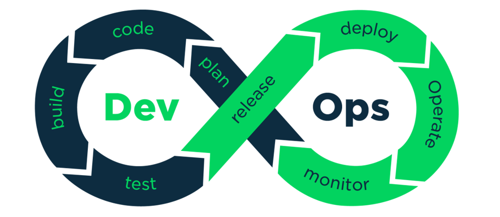

前端在团队进行 DevOps 转型的期间，需要进行一些什么样子的基础建设呢？


## 概述

本系列整理了一下从传统的瀑布模式开发到 DevOps 研发运维一体化的整个演进过程。内容很多，但对于正在进行 DevOps 转型的团队能起到不小的帮助，请耐心看完本系列。

DevOps（Development + Operations）是一组过程、方法与系统的统称，用于促进开发（应用程序/软件工程）、技术运营和质量保障（QA）部门之间的沟通、协作与整合。

随着 DevOps 的兴起，出现了**持续集成（Continuous Integration）**、**持续交付（Continuous Delivery）** 、**持续部署（Continuous Deployment）** 的新方法。传统的软件开发和交付方法变得过时，“小步快跑”才是主流。在瀑布模式下，大多数公司会每月，每季度甚至每年发布新版本。现如今，在 DevOps 时代，每周，每天，甚至一天多次是常态。当 `PaaS` 正在占领世界时，我们可以轻松地动态更新应用程序，而无需强迫客户下载新组件。


## 团队转型

### 建立快速敏捷团队

未转型前的团队结构和系统架构，一般分为七大部门：产品规划经理、视觉设计师、前端工程师、后端工程师、测试工程师、运维工程师、DBA等。各部门之间天然的形成了沟通障碍墙，相互之间主要以邮件和会议的形式沟通，效率低下、需求变更困难、很难快速响应市场变化和持续交付高品质的产品，如下图：

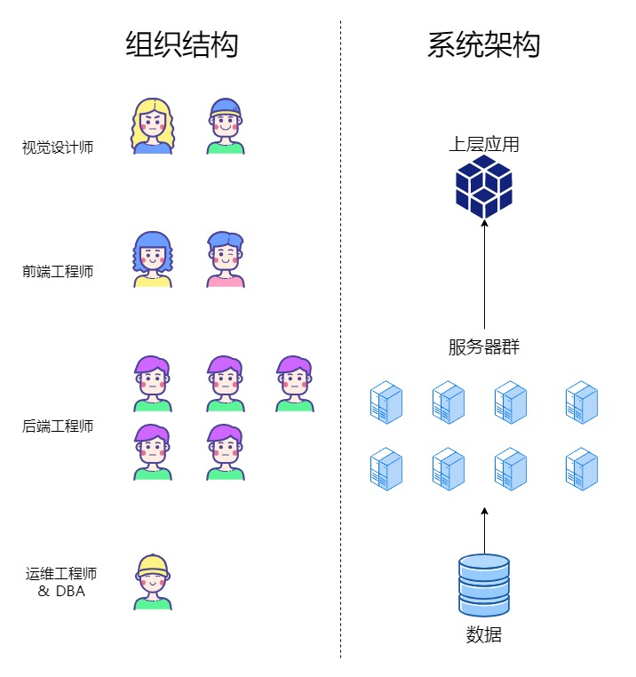

于是，我们对团队和架构进行一个调整：按照业务功能划分特性小组（Scrum 团队），设置产品负责人（一个规划人员）、Scrum Master（一般由技术专家级别担任）和开发者团队（前端工程师、后端工程师、测试）；这些团队负责自己的微服务同时要负责人员的管理。转型之后的组织结构和系统架构，如下图所示：

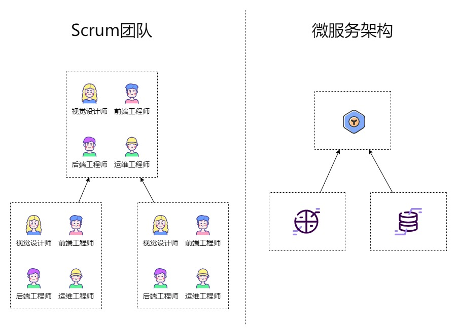

这是组织结构变化的部分，需求前端开发者融入到业务团队中，接下来讲一下前端架构的变化。

## 微服务架构

微服务架构将应用拆分为一系列可独立部署的服务，并通过 API 进行通信。这样，每个服务都可单独部署和扩展。这种方法允许快速、频繁地交付庞大且复杂的应用。与单体式应用不同，微服务架构允许团队更快地实施新功能并进行更改，并且大部分现有代码均无需重写。

### 微服务架构特征

##### 多个组件服务

微服务由单独的、松散耦合的组件服务构成，这些服务均可单独开发、部署、运营、更改和重新部署，而不影响其他服务的功能或应用的完整性。如此一来，便可快速、轻松地部署应用的各项功能。

##### 高度可维护性和可测试性

借助微服务，团队可试验新的功能，并在出现状况时回滚。这样，代码更新变得更加轻松，新功能的面市时间也得以加快。此外，隔离和修复单个服务中错误和漏洞的过程也得以简化。

##### 由小型团队负责

小型独立团队通常会在微服务内构建服务，鼓励[敏捷实践](https://www.atlassian.com/zh/agile)和 [DevOps](https://www.atlassian.com/zh/devops/what-is-devops)。团队可以独立工作和快速行动，从而缩短开发周期。

##### 根据业务能力进行组织

微服务方法根据业务能力来组织服务。各个团队均为跨职能团队，且具备开发所需的全部技能，从而努力实现某一职能。

##### 自动化基础架构

构建和维护微服务的团队通常使用基础架构自动化实践，例如**持续集成** (CI)、**持续交付** (CD) 和**持续部署**（也简称为 CD）。这样，团队便可独立构建和部署每项服务，而不影响其他团队。它还允许团队将新版本的服务与先前的版本并行部署。

### 架构独立

##### 独立构建

指的是一份源代码，可以随时随地的进行编译，不需要依赖外部服务的依赖。

##### 独立部署

指的是一份源代码，可以按照便于运维的管理要求去部署、升级、伸缩等，可通过配置来区分地域分布。服务间相互调用通过接口请求实现，部署独立性也是运维独立性的前提。

##### 独立测试

运维能够通过一些便捷的测试用例或者工具，验证该业务架构或服务的可用性。具备该能力的业务架构或服务让运维具备了独立上线的能力，而不需要每次发布或变更都需要开发或测试人员的参与。

##### 技术解耦

指的是降低服务和服务之间相互依赖的关系，也包含了降低代码对配置文件的依赖。这也是实现微服务的基础，实现独立部署、独立测试、组件化的基础。

### 微服务架构升级

#### 现状

将原先的传统项目团队划分为多个 Scrum 小组并行开发，多小组同时发布的分支处理和代码冲突之类的问题频繁出现，前端发布几乎成为业务快速发布版本的阻塞点。目前，我们开发和维护代码的现状：


- 一个仓库包含了所有的业务组的前端代码；
- 只能一起构建出一个整包，小组功能也无法单独部署；
- 后端已完成微服务的拆分。

如上所述，虽然一般场景通过 git 多分支管理能解决【独立开发】和【发布】的问题，但是遇到【多团队同时发布】的场景就让人头疼了：

- 需要拉上各个团队的负责人，反复确认当天能否正常上线；
- 上线分支排列组合（release-a、release-b、release-ab ）预防某一个团队突发问题不上线；
- 测试工作量增加：原本只要验收一个代码包，现在还要验证多个代码包功能（> 1）。

既然梳理了已有问题，为了解决这些问题，我们意识到和后端一样将整个项目拆分成若干的子应用，将它们也变成微服务，不就可以解决目前的困境了吗？自然而然我们就想到了“微前端”的概念。有目标，就好发力了，我们参考了业务优秀方案，同时结合了自身实际情况，最终决定用`webpack5 module federation `特性来进行微前端的实践与落地。


#### 架构解耦

制定了整个前端微服务方案后，我们的项目整体的架构变成了如下图展示的样子：


前端侧的代码按照小组特性拆分成若干个子应用：

- 每个子应用只拥有自己相关的代码，基座应用可以看成比较特殊的子应用，它提供工程能力，最好不要有业务代码；
- 将应用代码划分到 `packages/apps`文件下， 通过 `monorepo + pnpm` 进行管理依赖；
- 所有的文件夹进行单独的打包构建，搭配  `Docker + Kubernetes` 构建成单独的容器（红色部分内所有的子应用都是单独的容器）变成真正的微服务。

以上的变化，让拆分出来的子应用能够独立开发 - 维护 - 发布之外，还使得我们前端应用升级时的 灰度 - 部署 - 回滚 操作变得更加简单、快速。


#### 构建解耦

各个小组的前端代码存放在 `packages/*` 下，前端代码仓库目录：

```
platform
│  package.json
│
└─packages
   │  app1
   │  app2
   └─ app3
```


当每次更新代码时，会识别目标路径，单独构建产生变更的子应用，而不是以往的全量构建。如下图：

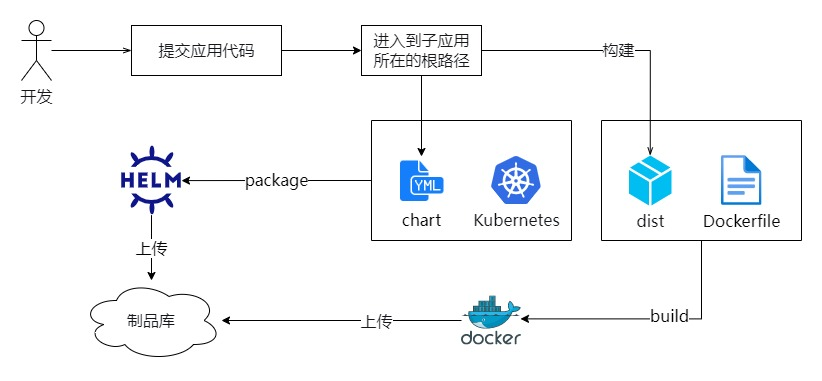


#### 发布解耦

在达成独立部署上线的目标之后，所有的子应用都是独立的，发布不需要依赖于任何应用。只需要确认开发修改了哪些子应用的代码，那么升级对应的子应用即可。如下图：


具体流程：

1. 开发修改了 A 应用的代码，上库；
2. 构建平台（千流，公司自建）识别到 A 应用产生了代码变更，接着对 A 应用进行打包，生成镜像、版本号等，推送到制品库；
3. 升级对应服务。


#### 配置解耦

在很多发布场景中，一个棘手的问题是：不仅应用存在代码层面的改动，还有伴随着特有的环境配置之类的改动，所以在发布时经常需要根据情况修改和选择正确的配置。但其实这个配置和应用代码一样，本身就是发布的一部分，而传统的通过控制台去维护的方式成本将会非常高。

举个例子：前端和  `nginx` 配置打交道比较多，像配置跨域、`gzip`  这些。那么这些 `nginx` 配置，我们可以通过 helm 编排的方式，搭配上镜像一同发布到环境上。这样就能优雅的解决配置类的发布问题了。


### 总结

一个高效的敏捷团队是 DevOps 能落地的保障，那么自动化流程就是保证产品快速交付和持续部署的有效机制，接下来为大家介绍我们是如何实现自动化流程的。


## 持续集成（Continuous Integration）

在瀑布模型的开发模式中，每个人都是在自己的开发分支上进行代码管理，直到各自模块完成再进行代码整合。整合过程的过程中非常痛苦：

1. 合并过程中的代码冲突；
2. 模块联动功能无法工作，需要进行一个再联调过程；
3. 主程序员每日需要阅读大量的代码；
4. 个人的代码质量不可控，以及过程风险无法及时透明；
5. ...

那么，持续集成是一种在开发周期的早期阶段进行集成的实践，以便构建、测试、整合代码可以更经常进行。

在 CI 中，同版本内的甲和乙同时在进行开发，他们每完成一个小功能（也可以按每天）就需要将代码提交到 `GitLab` 共同分支上，进行自动化构建，如果发现错误，可以及时修改几乎不需要什么排查成本。

CI 将整合过程变得日常化，这有利于我们在早期尽早发现集成错误，使团队更加紧密结合，更好地协作。

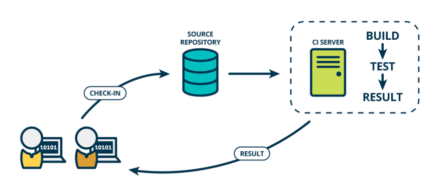


### 自动化流程

1. 开发提交本地代码触发 `git hooks`校验（`eslint`、`i18nlint`、`stylelint`、`commitlint`）
1. 推送到 `GitLab`，触发代码门禁（静态代码扫描、单元测试）；
2. 通过门禁后，将前端代码打包，获得一个 `platform.tar.gz` (包括`dist`、`Makefile`、`Dockerfile`、`chart`)；
3. 获取 `version`、 `dist` 和 `Dockerfile`，进行构建镜像；
4. 获取 `version`、`chart` 进行 helm 包构建；
5. （可选）构建完之后，结合 `Lighthouse` 对每次的包进行一次性能分析。

### 测试

快速获得反馈以了解在软件交付生命周期内更改所产生的影响，是构建高质量软件的关键。以前，团队依靠人工测试和代码检查来验证系统的正确性。此类检查和测试工作通常在“开发完毕”后的一个单独阶段进行。此方法具有以下缺点：

- 手动回归测试执行起来既耗时又费用高昂，这使其成为了整个流程中的瓶颈。无法频繁发布软件，开发者无法快速获得反馈。
- 人工检查和测试不可靠，原因是人们在手动回归测试等重复性任务中通常表现不佳，并且很难通过检查来预测复杂软件系统的更改会产生什么样的影响。
- 软件开发完成后，开发者必须等待很长时间才能获取其更改的相关反馈。通常需要大量工作来对缺陷进行分类和修复。性能、安全性和可靠性问题通常需要进行设计更改，如果在此阶段发现这些问题，费用便会更高。
- 较长的反馈周期还让开发者难以了解如何构建质量代码，而开发团队迫于日程压力，质量有时会被视为“其他人的问题”。
- 由于开发者不负责测试自己的代码，他们很难了解如何编写可测试的代码。
- 对于不断改进的系统，及时更新测试文档需要大量的努力。

相反，团队应该：

- 在软件交付生命周期内持续执行所有类型的测试。
- 创建并定制快速可靠的自动化测试套件，自动测试在持续交付流水线中运行。

这不仅能帮助团队更快地构建（和了解如何构建）高品质软件，据 DORA 的研究显示，软件的稳定性也因此提高了，而团队负担以及部署困难性都降低了。

### 容器化

容器化是指将软件代码和所需的所有组件（例如库、框架和其他依赖项）打包在一起，让它们隔离在自己的”容器“中。

这样，容器内的软件或应用就可以在任何环境和任何基础架构上一致地移动和运行，不受该环境或基础架构的操作系统影响。


容器之所以具有“轻量级”或“可移植”的特性，是因为它们能够共享主机的操作系统内核，不需要为每个容器提供单独的操作系统，且允许应用在任何基础架构（裸机、云）上运行相同的操作系统，甚至在虚拟机（VM）中。

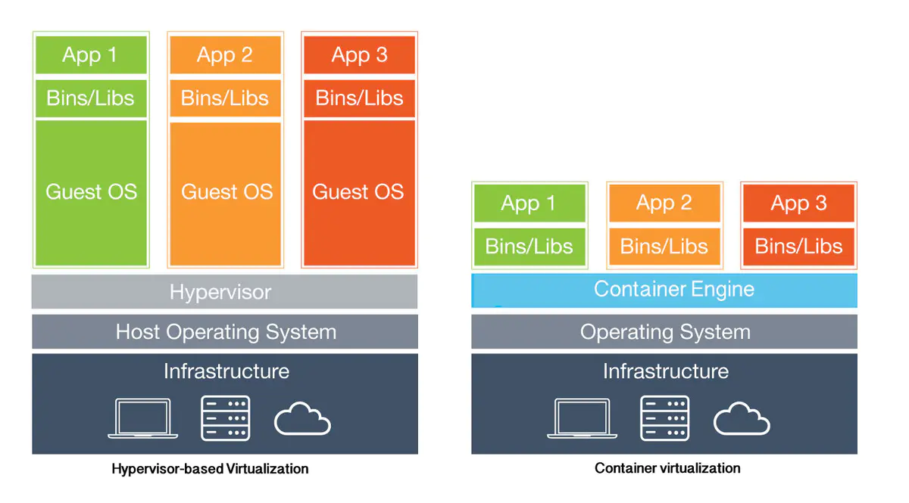

不管是虚拟机还是容器，似乎对前端而言，只要能让客户端加载到前端资源就没有什么区别。只不过推荐前端代码单独作为容器进行管理，而不是将前端资源存放在后端的服务中，对于前端想要进行一些架构改进能预留很大空间，而不会受限于外部。

再回头看我们刚将一个前端的巨石应用拆分成若干（1 -> n）个的微服务，就对应需要 n 个镜像。

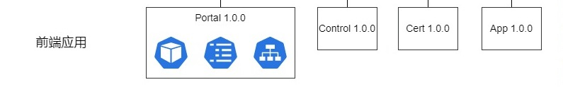


### 分支模型

- master：主线分支，基线归档。只接受 hotfix 以及 release 合入，不允许直接修改push。
- hotfix：线上版本bug的热修复分支，hotfix一般基于master拉出来，更新分支之后会自动执行端到端测试，修复完后合入到master。
- release：预发布（测试）主线分支。预发布分支，用于功能开发完成后的最后修改工作，更新分支之后会自动执行端到端测试。
- develop：开发主干分支。用于开发人员新加功能、修复bug，合入 release 后转测。
- feature：个人功能开发分支，命名：feature-功能特性-作者。
- bug：修改 bug 的分支，命名：bug-缺陷ID-作者。
- tag：对发布过的版本代码进行标记，有助以后有需要时进行回溯，命名:tag_ 发布时间 _版本号


## 持续交付（**Continuous Delivery**）

持续交付是持续集成的延伸或者看作持续集成的下一步，它将集成后的代码部署到类生产环境，确保可以以可持续的方式快速向客户发布新的更改。

持续交付意味着每次甲或乙对代码进行更改、集成和构建时，他们也会在与生产环境非常相似的状态下进行自动化代码测试。我们称这一系列的“部署 - 测试”到不同环境的操作为部署流水线。通常来说，部署流水线有一个开发环境，一个测试环境，还有一个准生产环境，但是这些阶段因团队，产品和组织各异。例如，我们团队有一个称为“演练环境”的准生产环境。（译注：消除开发环境和生产环境差异，参考Docker技术体系）

持续交付最小化部署或释放过程中固有的摩擦。它的实现通常能够将构建部署的每个步骤自动化，以便任何时刻能够安全地完成代码发布（理想情况下）。

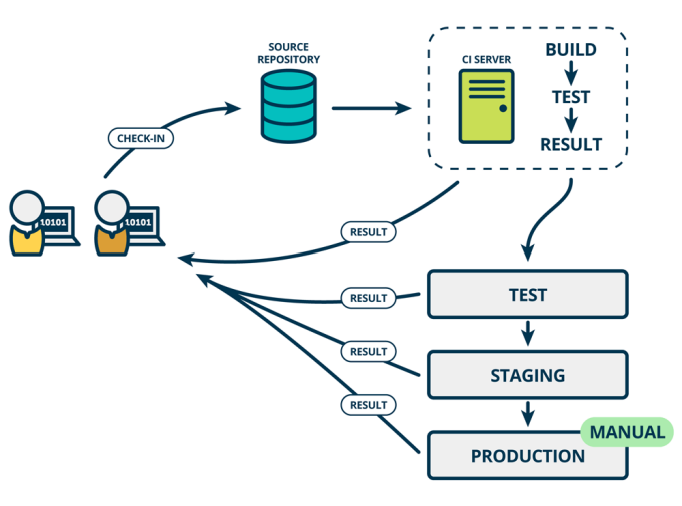


### 完整流程

1. 获取持续集成中的产物 `platform.tar.gz` ；
2. 获取镜像 `platform`，然后推送到远程仓库；
3. 获取 helm 包 `platform`，然后推送到远程仓库；
4. 镜像和 helm 包成功推送到远程仓库之后，测试接收到新包的通知，进行一个包部署，验证功能；
5. （可选）执行 E2E 自动化测试用例；
6. 最后进行发布流程申请。


### 看前端

我们交付的产物大多是以 `webpack` 构建之后的产物 `dist  ` 包（包含`HTML`、`JS`、`CSS`、附件等）传递给测试，他们拿着这个包再到服务器上进行资源替换。

在以前，我们是这样进行交付的：

1. 在 `gitlab` 上执行流水线构建产物；
2. 通过 `shell` 脚本自动化上传产物到目标服务器并进行一个资源替换和备份；
2. 测试验证通过，进行生产环境发布。

我们以前的流水线是从编译构建，一直编排到测试验证到生产环境发布。而在持续集成和持续交付分离后，交付流水线则需要进行单独设计。

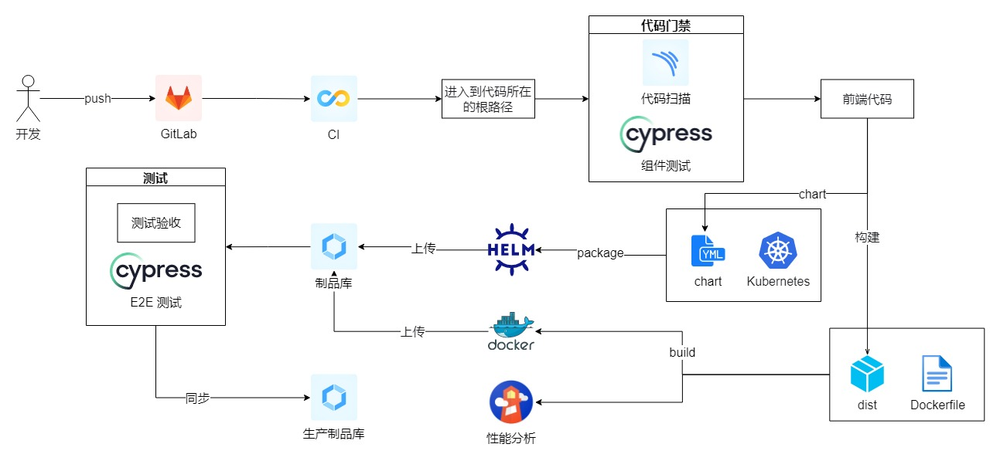

在 DevOps 和容器化的时候，整个自动化部署过程发生了变化，即：

1. 编译构建完先制作镜像；

2. 再推送到制品库；

3. 最后再从制品库提取镜像 + 配置信息进行部署。

我们同样的一个 Docker 镜像，同样的一份 helm 文件，可以在不同的环境中使用，这样就能够保证从开发、测试、上线所有东西的一致性。


### 自动化测试

想要进行持续集成和持续交付，则需要高质量的测试自动化。测试是检查软件是否能按预期工作的方法。自动化测试是编码的测试，当代码提交到公共源码库，就自动运行。

在完成了 CI 和容器化的改变后。我们接下来考虑另一个重点内容：**测试和质量管理**。

对于测试和质量管理包括了很多内容，如下：

1. 静态测试：代码规范性检查，安全检查，漏洞扫描；
2. 自动化测试：单元测试，UI 端到端测试、接口测试。

测试本身是一个系统工程，需要覆盖从测试场景分析，测试设计，测试执行，测试评估完整生命周期。中间还需要对测试用例脚本，测试数据等进行管理。

而从 DevOps 实施角度，更多的是考虑整个测试过程如何自动化，通过将测试过程集成和编排到整个 DevOps 流水线执行过程中，真正实现研发和 QA 之间的自动化协同能力。

我们前端主要通过 3 个节点自动执行测试的工作：

1. 提交代码时：这个环节主要通过 `eslint`、`I18nlint`、`stylelint ` 保证增量提交的代码不存在低级规范问题，`commitlint` 保证提交信息规范化。
2. 推送代码到 `GitLab` 后：这个环节有两个步骤：代码静态扫描和组件测试。前者保证代码基本质量，如：checklist、安全问题等；后者保证业务代码的功能是否正常。
3. 合并代码到转集成分支后：这个环节在版本转测时，测试同事还未开始手动执行用例之前，需要进行一次全量的端到端测试用例的执行。


## 持续部署（Continuous Deployment）

持续部署是持续交付的下一步，在持续交付的基础上，由开发人员或运维人员自助式的定期向生产环境部署稳定的构建版本，持续部署的目标是代码在任何时刻都是可部署的，并可自动进入到生产环境。

这是一种实践，即：甲和乙所做的每一项变更，在通过所有的测试阶段之后，自动部署到生产环境。Tim Fitz首先提出了一个很好的解释：有些公司这么干，有些则不这样做。想要实现持续部署，首先要实现持续交付。因此在开始实践 CD 之前，决定哪个更适合你是不重要的。无论哪种方式，我认为持续交付是关于有助于整个业务能力的事情，因此你至少应该参与决定是否使用持续部署。毕竟，如果你正在阅读这篇文章，那么你可能就是在“业务方面”。

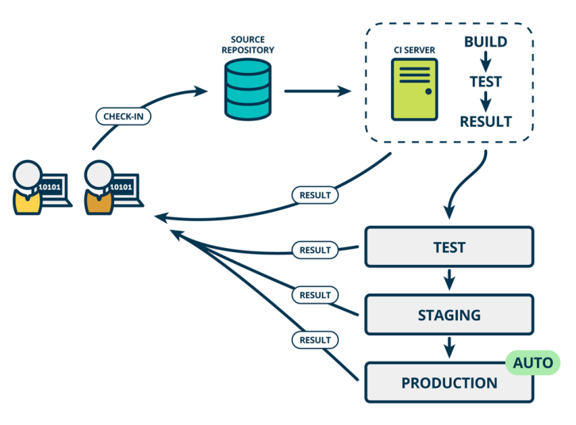


### 部署自动化

部署自动化使您能够一键式将软件部署到测试和生产环境。自动化对于降低生产部署的风险至关重要。在更改后，团队需要尽快进行全面测试以提供有关软件质量的快速反馈。

自动部署流程需要输入以下信息：

- 由持续集成 (CI) 流程创建的软件包（这些软件包应可部署到任何环境，包括生产环境）。
- 用于配置环境、部署软件包和执行部署测试（有时称为冒烟测试）的脚本。
- 特定于环境的配置信息。

### 完整流程

1. 转集成测试结束后，确认上线的镜像和 helm 包版本号 `version`（在上线的工单中需要填写）；
1. 运维同事在持续部署平台上，一键执行升级流水线，等待执行完毕就是升级成功了。


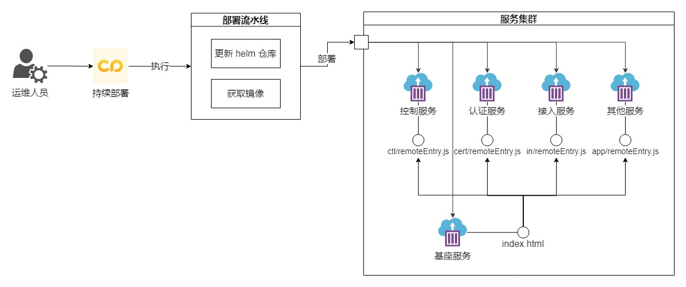

### 持续部署实践

#### 蓝绿部署（Blue-Green Deployments）

蓝绿部署是指有两个完全相同的、互相独立的生产环境，一个叫做“蓝环境”，一个叫做”绿环境“。绿环境是用户正在使用的生产环境。当要部署一个新版本的时候，先把这个新版本部署到蓝环境中，然后在蓝环境中运行冒烟测试，来检查是否正常工作，当一切准备就绪以后，向新版本迁移就非常简单了，只要修改一下路由配置，将用户流量从绿环境导向蓝环境就可以，这个时候蓝环境就变成了生产环境，这种切换通常在一秒钟之内就能搞定。如果出了问题，把路由器切回到绿环境上即可，然后在蓝环境中调试，找到问题的原因。所以蓝绿部署，是在部署之后，仅仅一次切换，立刻就向所有用户推出新版本，新功能对所有用户立刻生效可见。

如果由于成本和投资回报的考虑，不能建设两套完全一样的生产环境，那么可以将蓝环境作为预发或预生产环境，将软件的新版本部署在预发环境，并进行验收测试，之后将访问流量引流到这个预发环境，那么蓝环境就是正式的生产环境，同时保持旧版本所在的绿环境不变，直至新版本没有问题后，再将旧版本所运行的环境作为下一个新版本的预发环境。

#### 滚动部署（Rolling Deployment）

滚动部署是指从服务集群中选择一个或多个服务单元，停止服务后执行版本更新，再重新将其投入使用，循环往复，直至集群中所有的服务实例都更新到新版本，而不是将所有的服务实例一次性的同时更新。

滚动部署分批进行部署，每次同时更新的服务实例数称之为窗口大小（Window size），根据需要配置每个批次服务实例的窗口大小，例如首先部署2%的服务实例，第二批为10%，第三批为50%，第四批为100%。

### 灰度发布

通过 `istio` 建立灰度能力

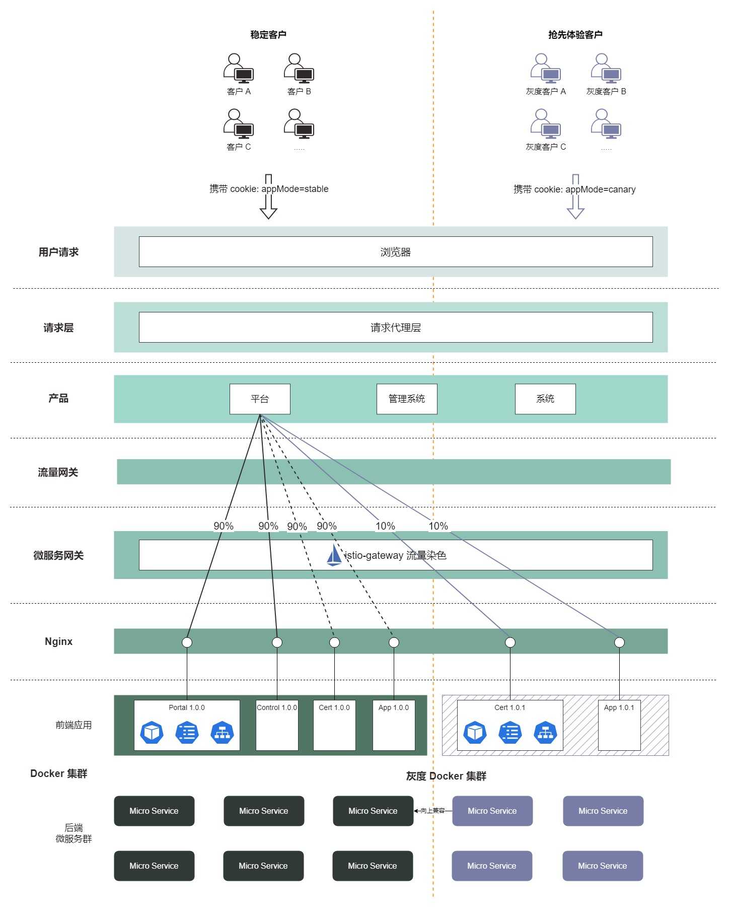

上图可以很好展示这种方案的效果，我们用不同的颜色来表示不同版本的灰度流量，可以看出无论是微服务网关还是微服务本身都需要识别流量，根据治理规则做出动态决策。当服务版本发生变化时，这个调用链路的转发也会实时改变，帮助开发者实时快速的对线上流量进行精细化的全链路控制。

可以发现：


1. 需要灰度发布的应用准备两个镜像（ `stable` 或 `canary` ）
1. 金丝雀平台配置灰度策略
1. 通过 `istio `  进行流量管理
1. 客户端访问服务端，根据灰度策略 `set-cookie`  ，根据这个标识进行流量染色，把流量引导到对应容器中去


#### 镜像

我们会在镜像名称上进行区分稳定版本和灰度版本，例如 `portal-stable` 和 `portal-canary`

#### 流量染色

请求链路上各个组件如何识别出不同的灰度流量？答案就是流量染色，为请求流量添加不同灰度标识来方便区分。我们可以在请求的源头上对流量进行染色，前端在发起请求时根据用户信息或者平台信息的不同对流量进行打标。如果前端无法做到，我们也可以在微服务网关上对匹配特定路由规则的请求动态添加流量标识。此外，流量在链路中流经灰度节点时，如果请求信息中不含有灰度标识，需要自动为其染色，接下来流量就可以在后续的流转过程中优先访问服务的灰度版本。


## 持续监测

在完成了持续部署的改变后。我们接下来考虑另一个重点内容：**上线后的持续监控运维**。

持续监视为交付不同阶段的应用程序的操作，质量保证，开发，业务线所有者和其他利益相关者提供数据和指标。度量标准不限于生产。

一套完善的监控体系大概包含了：

1. 基础设施监控
2. 系统层监控
3. 应用层监控
4. 业务监控
5. 端用户体验监控

本文我们只分享**端用户体验监控**：用户通过浏览器打开我们产品，那么在用户端，用户的体验是怎么样？用户端的性能是怎么样？以及有没有产生错误等等。这些信息都需要进行监控并记录下来，如果没有监控，有可能因为某些BUG或者性能问题，造成用户体验非常差，而我们并没有感知。

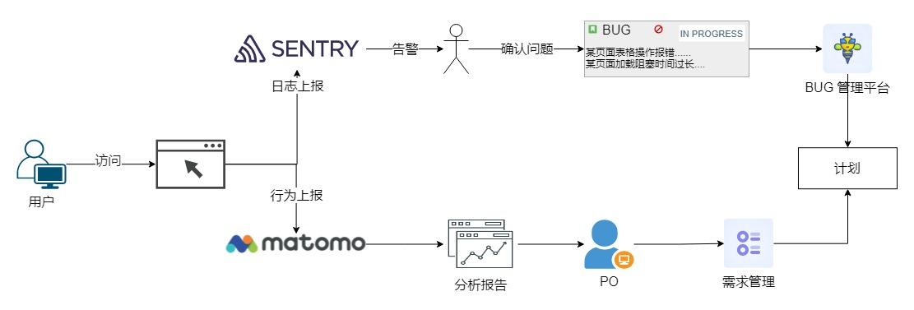


### Sentry

项目通过 SDK 的方式接入 Sentry 平台。Sentry 平台采集用户使用过程中的异常，分析潜在的问题。

#### 异常采集

1. 监控脚本执行错误。监控方法：监控DOM 0级或者DOM 2级 error 事件
2. 资源加载(JS、CSS、image等)错误。监控方法：监控DOM 0级或者DOM 2级 error 事件
3. 未处理的Promise错误。监控方法：通过DOM 2级事件rejectionhandled捕获
4. 接口请求(xhr、fetch)错误。监控方法：通过改写请求方法，发现接口错误时主动上报错误 
5. 框架集成错误。监控方法：通过框架自身的配置扩展，如：`Vue.config.errorHandler`

#### 数据储存

#### 统计分析

#### 报告告警


### Matomo


## 组件中台

## 质量内建

要进行持续集成和持续交付，需要高质量的测试自动化。测试是检查软件是否能按预期工作的方法。自动化测试是编码的测试，当代码提交到公共源码库，就自动运行。

在CI的世界里，每次代码集成和构建时都会运行单元测试。如果测试没有通过，则认为 "构建失败"、"红灯 "或 "坏"。在构建失败的情况下，开发同事（不管是谁提交了故障代码）需要 "修复它"，"让它变绿 "或 "让它工作"。他们可以通过对代码进行修改来修复它，或者删除之前破坏它的修改来做到这一点。

### 单元测试

单元测试是代码中的自动化测试，它测试低级别的、单一的代码片断，以确保它们可以使用并按预期工作。单元测试被认为是实践CI和CD的先决条件。

## 环境准备


### 制作前端编译环境镜像

因为前端代码需要在 `node` 环境上进行打包，并且我们希望在这个环境上可以加一些和项目相关的工具，例如：`pnpm`、`eslint` 等等高度定制的打包环境，因此我们需要制作一个项目特定的打包环境镜像用来进行项目打包。具体配置如下：

```dockerfile
# Dockerfile images: web-pipeline
FROM centos:7

ARG NODE_VERSION
COPY CentOS-Base.repo /etc/yum.repos.d/CentOS-Base.repo

RUN yum makecache && yum update -y \
    && yum install -y git \
    && yum -y install wget \
    && mkdir /usr/local/webui-env \
    # 安装 node 环境
    && wget wget http://nodejs.org/dist/v${NODE_VERSION}/node-v${NODE_VERSION}-linux-x64.tar.xz \
    && tar -xvf node-v${NODE_VERSION}-linux-x64.tar.xz -C /usr/local/webui-env \
    && ln -s /usr/local/webui-env/node-v${NODE_VERSION}-linux-x64/bin/node /usr/bin/node \
    && ln -s /usr/local/webui-env/node-v${NODE_VERSION}-linux-x64/bin/npm /usr/bin/npm \
    # 可安装一些项目里面全局的内容，定制
    # 安装 pnpm
    && npm install pnpm -g \
    && ln -s /usr/local/webui-env/node-v${NODE_VERSION}-linux-x64/lib/node_modules/pnpm/bin/pnpm /usr/bin/pnpm
```


### 制作 Lighthouse 环境镜像

`Lighthouse` 是一个开源的分析网页质量的自动化工具。我们可以运行它对构建完之后的前端代码进行一个性能、可访问性、搜索引擎优化等分析。

因此，我们每一次修改完代码，打包之后，还会执行进行 `lighthouse` 的性能分析，收集每个包过程中的性能分析的报告，用于分析网页质量，及早发现项目中存在的质量问题。在出现性能之类的质量问题时，因为我们每一次的打包都有报告，所以我们可以十分方便定位到具体的提交，从而减少排查性能问题的时间。

```dockerfile
FROM centos:7

ARG NODE_VERSION
ENV WEBUI_DIR=/usr/local/webui-env

COPY CentOS-Base.repo /etc/yum.repos.d/CentOS-Base.repo

COPY google-chrome-stable_current_x86_64.rpm /google-chrome-stable_current_x86_64.rpm

# 安装git、sshpass、wget以及创建软件放置目录
RUN yum makecache && \
    # 安装git
    yum install git -y && \
    # 安装sshpass
    yum install sshpass -y && \
    # 安装wget
    yum install wget -y && \
    # 安装 chrome 浏览器
    yum install /google-chrome-stable_current_x86_64.rpm -y && \
    # 创建前端软件包的安装目录
    mkdir -p ${WEBUI_DIR}

# 安装 node 环境
RUN cd ${WEBUI_DIR} && \
    wget wget http://nodejs.org/dist/v${NODE_VERSION}/node-v${NODE_VERSION}-linux-x64.tar.xz \
    && tar -xvf node-v${NODE_VERSION}-linux-x64.tar.xz -C /usr/local/webui-env \
    && ln -s /usr/local/webui-env/node-v${NODE_VERSION}-linux-x64/bin/node /usr/bin/node \
    && ln -s /usr/local/webui-env/node-v${NODE_VERSION}-linux-x64/bin/npm /usr/bin/npm \

    # 安装pnpm
    npm install -g pnpm@6.32.3 && \
    ln -s ${WEBUI_DIR}/node-v${NODE_VERSION}-linux-x64/bin/pnpm /usr/local/bin/ && \
    ln -s ${WEBUI_DIR}/node-v${NODE_VERSION}-linux-x64/bin/pnpx /usr/local/bin/
```


### 制作自动化测试镜像

项目用的是 `Cypress`，所以这里直接使用它官网提供的镜像即可。

```dockerfile
FROM cypress/base:16.4.0

# 安装 pnpm
RUN npm install -g pnpm

CMD echo  " node version: $(node -v) \n" \
    "pnpm version: $(pnpm -v) \n"
```


### Makefile 

可能对于 `Makefile` 不太熟悉，这里稍微解释一下：`Makefile` 可以简单的认为是一个工程文件的编译规则，描述了整个工程的编译和链接等规则。像我们项目不仅要进行【代码构建】、【镜像构建】、【helm 制作】等很多操作。

1. 把各个环节需要进行的操作分散在各个平台明显对后续维护不友好，上手成本高，而且每个项目的配置很可能不同；
2. 如果配置信息发生改变，这么多平台很难保证都能及时进行修改。

因此，使用 `Makefile` 将这些构建操作和仓库代码放在一起管理更好。具体配置：

#### 项目配置

```makefile
# makefile v0.0.1
BRANCH := $(strip $(CI_BUILD_REF_NAME))
DATE := $(shell date +%Y%m%d)

.PHONY: install clean build

# helm 构建并推送
push_helm:
	@cd chart && helm package platform-portal --version $(VERSION)
	@sfspm upload ./chart/platform-portal-$(VERSION).tgz $(HELM_REPOSITORY)

# 镜像构建
push_image:
	@echo build image for sase-platform-portal:$(VERSION)
	# 从将当前目录编译成镜像
	@docker build -t $(REPOSITORY_PATH)/$(REPOSITORY_KEY)/sase-platform-portal:$(VERSION) .
	# 推送镜像到harbor仓库
	@docker push $(REPOSITORY_PATH)/$(REPOSITORY_KEY)/platform-portal:$(VERSION)
	# 删除本地镜像
	@docker rmi $(REPOSITORY_PATH)/$(REPOSITORY_KEY)/platform-portal:$(VERSION)
	
lighthouse:
	@echo performance analysis for sase-platform-portal:$(VERSION)
	@lhci autorun

# 前端打包规则
build:
	# 编译打包
	@pnpm install
	@pnpm build
	# 将版本信息都加到容器内部
	@echo $(BRANCH)-$(VERSION)-$(DATE) > ./dist/appversion
	# 打包
	@tar -zcvf platform_$(BRANCH)_$(VERSION)_$(DATE).tar.gz Makefile Dockerfile dist chart
```

#### 使用

在 `Unix` 环境下，存在 `Makefile`  下目录执行

```shell
make build
make push_image
make push_helm
```


### 交付物

我们在 `web-pipeline` 环境下进行一个打包，这个镜像中，我们之前已经安装过了 `git` 、`node`、`pnpm` 等工具了。当我们触发打包操作时，它会先执行前端的编译，接着再进行制作镜像上传，最后制作 helm 包上传。


#### 前端编译

执行 `Makefile` 中的 `build` 获取 `platform.tar.gz` 包 

```shell
echo "【镜像打包】开始！"
make build
```


#### 镜像制作

获取项目中的 `Dockerfile` 和 `dist` 包

```dockerfile
# Dockerfile
FROM nginx:1.21.0

ENV NODE_ENV=production 

RUN mkdir -p /usr/service/webui
COPY ./dist /usr/service/webui

CMD ["nginx", "-g", "daemon off;"]
```

接着执行 `Makefile` 中的命令。

```shell
make push_image
```


#### helm 制作

获取项目中的 `chart` 和 `version` 全局变量；接着执行 `Makefile` 中的命令。

```sh
make push_helm
```


#### Lighthouse 性能分析

```sh
make lighthouse
```


### Sentry 平台搭建


### Matomo 平台搭建

