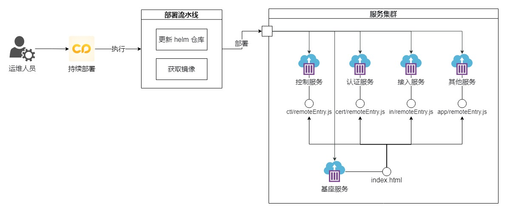

# 《大型 toB 项目基建实战》——持续交付


## 背景

最初是**瀑布模型**，后来是**敏捷开发**，现在是 **DevOps**，这是现代开发人员构建出色的产品的技术路线。随着 DevOps 的兴起，出现了**持续集成（Continuous Integration）**、**持续交付（Continuous Delivery）** 、**持续部署（Continuous Deployment）** 的新方法。传统的软件开发和交付方法正在迅速变得过时。从历史上看，在敏捷时代，大多数公司会每月，每季度，每两年甚至每年发布部署/发布软件。现如今，在 DevOps 时代，每周，每天，甚至每天多次是常态。当 `PaaS` 正在占领世界时，尤其如此，您可以轻松地动态更新应用程序，而无需强迫客户下载新组件。

**持续集成（CI）**的重点是将各个开发人员的工作集合到一个代码仓库中。通常，每天都要进行几次，主要目的是尽早发现集成错误，使团队更加紧密结合，更好地协作。
**持续交付（CD）**的目的是最小化部署或释放过程中固有的摩擦。它的实现通常能够将构建部署的每个步骤自动化，以便任何时刻能够安全地完成代码发布（理想情况下）。
**持续部署（CD）**是一种更高程度的自动化，无论何时对代码进行重大更改，都会自动进行构建/部署。这些阶段中的每一个都是交付管道的一部分 。


## 看前端

我们交付的产物大多是以 `webpack` 构建之后的产物 `dist  ` 包（包含`HTML`、`JS`、`CSS`、附件等）传递给测试，他们拿着这个包再到服务器上进行资源替换。

在这个过程，虽然我们做到各个环节实现自动化：`gitlab` 上执行 `CI` 构建产物，通过 `shell` 脚本自动化上传产物到目标服务器并进行一个资源替换和备份；但是只要资源是存放在虚拟机上的某个目录下，就意味着容易修改。于是，我们经常遇到各种问题：

1. 前端包的版本是多少？
2. 谁又手动去服务器上替换前端包了？
3. 前端开发帮忙看看这个包版本是否为最新？
4. ...

于是，我们团队将前端代码也制作为一个镜像进行传递。如下图，是我们改造之后的完整持续集成和持续交付的流程图：


## 持续集成流程

1. 开发将本地代码推送到 `GitLab`，触发代码门禁（代码扫描、单元测试）；
2. 通过门禁后，将前端代码打包，获得一个 `platform.tar.gz` (包括`dist`、`Makefile`、`Dockerfile`、`chart`)；
3. 获取 `version`、 `dist` 和 `Dockerfile`，进行构建镜像；
4. 获取 `version`、`chart` 进行 helm 包构建；
5. （可选）构建完之后，结合 `Lighthouse` 对每次的包进行一次性能分析。


## 持续交付流程

1. 获取持续集成中的产物 `platform.tar.gz` ；
2. 获取镜像 `platform`，然后推送到远程仓库；
3. 获取 helm 包 `platform`，然后推送到远程仓库；
3. 镜像和 helm 包成功推送到远程仓库之后，测试接收到新包的通知，进行一个包部署，验证功能；
3. （可选）执行 E2E 自动化测试用例；
3. 最后进行发布流程申请。


## 持续部署流程

1. 转集成测试结束后，确认上线的镜像和 helm 包版本号 `version`（在上线的工单中需要填写）；
1. 运维同事在持续部署平台上，一键执行升级流水线，等待执行完毕就是升级成功了。




## 线上监测


## 环境准备


### 制作前端编译环境镜像

因为前端代码需要在 `node` 环境上进行打包，并且我们希望在这个环境上可以加一些和项目相关的工具，例如：`pnpm`、`eslint` 等等高度定制的打包环境，因此我们需要制作一个项目特定的打包环境镜像用来进行项目打包。具体配置如下：

```dockerfile
# Dockerfile images: web-pipeline
FROM centos:7

ARG NODE_VERSION
COPY CentOS-Base.repo /etc/yum.repos.d/CentOS-Base.repo

RUN yum makecache && yum update -y \
    && yum install -y git \
    && yum -y install wget \
    && mkdir /usr/local/webui-env \
    # 安装 node 环境
    && wget wget http://nodejs.org/dist/v${NODE_VERSION}/node-v${NODE_VERSION}-linux-x64.tar.xz \
    && tar -xvf node-v${NODE_VERSION}-linux-x64.tar.xz -C /usr/local/webui-env \
    && ln -s /usr/local/webui-env/node-v${NODE_VERSION}-linux-x64/bin/node /usr/bin/node \
    && ln -s /usr/local/webui-env/node-v${NODE_VERSION}-linux-x64/bin/npm /usr/bin/npm \
    # 可安装一些项目里面全局的内容，定制
    # 安装 pnpm
    && npm install pnpm -g \
    && ln -s /usr/local/webui-env/node-v${NODE_VERSION}-linux-x64/lib/node_modules/pnpm/bin/pnpm /usr/bin/pnpm
```


### 制作 Lighthouse 环境镜像

`Lighthouse` 是一个开源的分析网页质量的自动化工具。我们可以运行它对构建完之后的前端代码进行一个性能、可访问性、搜索引擎优化等分析。

因此，我们每一次修改完代码，打包之后，还会执行进行 `lighthouse` 的性能分析，收集每个包过程中的性能分析的报告，用于分析网页质量，及早发现项目中存在的质量问题。在出现性能之类的质量问题时，因为我们每一次的打包都有报告，所以我们可以十分方便定位到具体的提交，从而减少排查性能问题的时间。

```dockerfile
FROM centos:7

ARG NODE_VERSION
ENV WEBUI_DIR=/usr/local/webui-env

COPY CentOS-Base.repo /etc/yum.repos.d/CentOS-Base.repo

COPY google-chrome-stable_current_x86_64.rpm /google-chrome-stable_current_x86_64.rpm

# 安装git、sshpass、wget以及创建软件放置目录
RUN yum makecache && \
    # 安装git
    yum install git -y && \
    # 安装sshpass
    yum install sshpass -y && \
    # 安装wget
    yum install wget -y && \
    # 安装 chrome 浏览器
    yum install /google-chrome-stable_current_x86_64.rpm -y && \
    # 创建前端软件包的安装目录
    mkdir -p ${WEBUI_DIR}

# 安装 node 环境
RUN cd ${WEBUI_DIR} && \
    wget wget http://nodejs.org/dist/v${NODE_VERSION}/node-v${NODE_VERSION}-linux-x64.tar.xz \
    && tar -xvf node-v${NODE_VERSION}-linux-x64.tar.xz -C /usr/local/webui-env \
    && ln -s /usr/local/webui-env/node-v${NODE_VERSION}-linux-x64/bin/node /usr/bin/node \
    && ln -s /usr/local/webui-env/node-v${NODE_VERSION}-linux-x64/bin/npm /usr/bin/npm \

    # 安装pnpm
    npm install -g pnpm@6.32.3 && \
    ln -s ${WEBUI_DIR}/node-v${NODE_VERSION}-linux-x64/bin/pnpm /usr/local/bin/ && \
    ln -s ${WEBUI_DIR}/node-v${NODE_VERSION}-linux-x64/bin/pnpx /usr/local/bin/
```


### 制作自动化测试镜像

项目用的是 `Cypress`，所以这里直接使用它官网提供的镜像即可。

```dockerfile
FROM cypress/base:16.4.0

# 安装 pnpm
RUN npm install -g pnpm

CMD echo  " node version: $(node -v) \n" \
    "pnpm version: $(pnpm -v) \n"
```


### Makefile 

可能对于 `Makefile` 不太熟悉，这里稍微解释一下：`Makefile` 可以简单的认为是一个工程文件的编译规则，描述了整个工程的编译和链接等规则。像我们项目不仅要进行【代码构建】、【镜像构建】、【helm 制作】等很多操作。

1. 把各个环节需要进行的操作分散在各个平台明显对后续维护不友好，上手成本高，而且每个项目的配置很可能不同；
2. 如果配置信息发生改变，这么多平台很难保证都能及时进行修改。

因此，使用 `Makefile` 将这些构建操作和仓库代码放在一起管理更好。具体配置：

#### 项目配置

```makefile
# makefile v0.0.1
BRANCH := $(strip $(CI_BUILD_REF_NAME))
DATE := $(shell date +%Y%m%d)

.PHONY: install clean build

# helm 构建并推送
push_helm:
	@cd chart && helm package platform-portal --version $(VERSION)
	@sfspm upload ./chart/platform-portal-$(VERSION).tgz $(HELM_REPOSITORY)

# 镜像构建
push_image:
	@echo build image for sase-platform-portal:$(VERSION)
	# 从将当前目录编译成镜像
	@docker build -t $(REPOSITORY_PATH)/$(REPOSITORY_KEY)/sase-platform-portal:$(VERSION) .
	# 推送镜像到harbor仓库
	@docker push $(REPOSITORY_PATH)/$(REPOSITORY_KEY)/platform-portal:$(VERSION)
	# 删除本地镜像
	@docker rmi $(REPOSITORY_PATH)/$(REPOSITORY_KEY)/platform-portal:$(VERSION)
	
lighthouse:
	@echo performance analysis for sase-platform-portal:$(VERSION)
	@lhci autorun

# 前端打包规则
build:
	# 编译打包
	@pnpm install
	@pnpm build
	# 将版本信息都加到容器内部
	@echo $(BRANCH)-$(VERSION)-$(DATE) > ./dist/appversion
	# 打包
	@tar -zcvf platform_$(BRANCH)_$(VERSION)_$(DATE).tar.gz Makefile Dockerfile dist chart
```

#### 使用

在 `Unix` 环境下，存在 `Makefile`  下目录执行

```shell
make build
make push_image
make push_helm
```


### 交付物

我们在 `web-pipeline` 环境下进行一个打包，这个镜像中，我们之前已经安装过了 `git` 、`node`、`pnpm` 等工具了。当我们触发打包操作时，它会先执行前端的编译，接着再进行制作镜像上传，最后制作 helm 包上传。


#### 前端编译

执行 `Makefile` 中的 `build` 获取 `platform.tar.gz` 包 

```shell
echo "【镜像打包】开始！"
make build
```


#### 镜像制作

获取项目中的 `Dockerfile` 和 `dist` 包

```dockerfile
# Dockerfile
FROM nginx:1.21.0

ENV NODE_ENV=production 

RUN mkdir -p /usr/service/webui
COPY ./dist /usr/service/webui

CMD ["nginx", "-g", "daemon off;"]
```

接着执行 `Makefile` 中的命令。

```shell
make push_image
```


#### helm 制作

获取项目中的 `chart` 和 `version` 全局变量；接着执行 `Makefile` 中的命令。

```sh
make push_helm
```


#### Lighthouse 性能分析

```sh
make lighthouse
```


