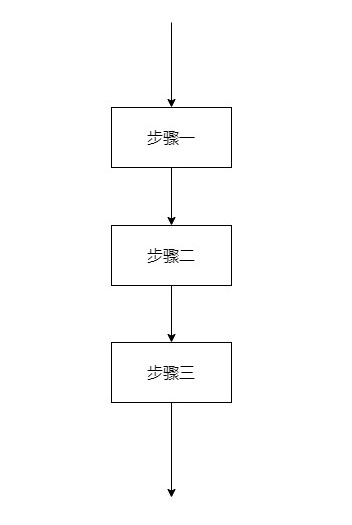

# 怎么做到一图胜千言

> 一张图片胜过千言万语

本文将介绍方案设计和程序设计过程中常遇到两种图的类型：【流程图】和【时序图】。

## 流程图

**流程图（Flow Chart），顾名思义，就是用来直观地描述一个工作过程的具体步骤图，它使用图形表示流程思路，是一种极好的方法**。它在一些技术设计、工作步骤及商业简报等领域应用较为广泛，也可以称之为输入-输出图。它通常用一些图框来表示各种类型的操作，在框内写出各个步骤，然后用带箭头的线把它们连接起来，以表示执行的先后顺序，用图形表示执行步骤，十分直观形象，易于理解。

### 什么时候需要流程图

首先，流程图作为一个工具，帮助我们把一个复杂的过程简单而直观地展示出来，大大提高了我们的效率。其次，在我们画出一张流程图之后，方便我们将实际操作的步骤和我们想象的过程进行比较、对照，更加方便我们寻求改进的机会。最后，流程图还能帮助我们将工作过程中复杂的、有问题的、重复的部分、多余的环节以及可以简化和标准化的地方都显示出来，有利于我们把复杂流程简单化。

通常，对于希望创建流程的人来说，无论创建的是什么样的流程，流程图都是很有用的。画流程图主要有以下好处：

1. 一张简明的流程图，能帮我们梳理方案的实现，让思考的思路更清晰、逻辑更顺畅，有助于流程的逻辑实现和有效解决实际问题。
2. 流图还能帮助我们查漏补缺，避免技术方案上出现遗漏，确保方案的完整性。通过梳理流程上的关键节点，可以快速发现遗漏之处，以便及时整改，保证后续方案执行的顺畅。
3. 流程图能够有效提升我们与同事之间的沟通效率。当一个技术方案比较复杂，判定条件较多，用口头难以表达清楚，用一张流程图，就能高效地解决沟通问题。

### 常见符号

首先需要注意的就是流程图的符号要求。

如上图所示，这些就是流程图设计中比较常用的一些形状。它们都有特定的含义，正确的使用能让流程图更加清晰。在绘制流程图中，符号使用是最容易出错的。

### 三大结构

流程图规范有三大结构，分别为顺序结构、选择结构和循环结构。

#### 顺序结构

这种结构最简单，各个步骤是按先后顺序执行的。如图，A、B、C是三个连续的步骤，它们是按顺序执行的，即完成上一个框中指定的操作才能再执行下一个动作。

#### 选择结构

选择结构又称分支结构，用于判断给定的条件，根据判断的结果判断某些条件，根据判断的结果来控制程序的流程。

#### 循环结构

循环结构又称为重复结构，指在程序中需要反复执行某个功能而设置的一种程序结构。它由循环体中的条件，判断继续执行某个功能还是退出循环。

根据判断条件，循环结构又可细分为以下两种形式：先判断后执行的循环结构（当型结构），和先执行后判断的循环结构（直到型结构）。

### 基本原则

1. 制作流程图时，应按逻辑顺序列出所有要求。
2. 流程图应该清晰、工整、易于理解。不要有含糊的地方。
3. 常用的流程图方向是从左到右或者从上到下。
4. 流程符号应该只有1条连接线连接下一个图形。
5. 应该只有1条连接线输入一个判定符号，但是有2到3根连接线输出判定符号，每根代表1个可能的决策。
6. 仅有一根连接线用于连接结束符号。
7. 在标准流程图符号内简要说明符号代表的内容。必要时，你可以用注释符号更清晰地描述数据或计算步骤。
8. 如果流程图很复杂，最好用连接符号以减少连接线的数量。为了得到更有效的流程图，更好地沟通信息，尽量避免连接线交叉。
9. 确保流程图有一个逻辑的*起点和终点。*
10. 用简单的测试数据来测试流程图的有效性是非常有用的。

### 基本步骤

1. 识别问题：需要可视化的过程是什么？
2. 定义目的
3. 按正确顺序列出主路径的步骤
4. 将每个步骤确定为输入/输出/数据、流程、文档或其他
5. 通过将一些复杂的任务分解为更小和更具体的步骤来优化您的流程图。
6. 考虑和细化选择和迭代路径和逻辑
7. 根据目的审查和修改流程图。

### 绘制细节

1. 绘制流程图时，为了提高流程图的逻辑性，应遵循从左到右、从上到下的顺序排列。
2. 一个流程从开始符开始，以结束符结束。开始符号只能出现一次，而结束符号可出现多次。若流程足够清晰，可省略开始、结束符号。
3. 菱形为判断符号，必须要有“是和否（或Y和N）”两种处理结果，意思是说，菱形判断框一定需要有两条箭头流出；且判断符号的上下端流入流出一般用“是（或Y）”，左右端流入流出用“否（或Y）”。
4. 同一流程图内，符号大小需要保持一致，同时连接线不能交叉，连接线不能无故弯曲。
5. 流程处理关系为并行关系的，需要将流程放在同一高度。
6. 必要时应采用标注，以此来清晰地说明流程，标注要用专门的标注符号。
7. 处理流程须以单一入口和单一出口绘制，同一路径的指示箭头应只有一个。
8. 同一路径的指示箭头应只有一个。
9. 流程图中，如果有参考其他已经定义的流程，不需重复绘制，直接用已定义流程符号即可。
9. 不要在一张图上表达两种不同的信息流。
9. 一个完整图最好不要超过 20 个节点，节点越多，图的复杂度上升，可读性也会随之下降。

## 数据流程图

数据流程图（Data Flow Diagram，DFD）是描述系统数据流程的工具，它将数据独立抽象出来，通过图形方式描述信息的来龙去脉和实际流程。它是一种能全面地描述信息系统逻辑模型的主要工具。它可以利用少数几种符号综合的反映出信息在系统中的流动、处理和存储的情况。数据流程图具有抽象性和概括性。

### 常见符号

### 基本结构

### 基本原则

1. 数据流程图上所有图形符号必须是前面所述的四种基本元素。
2. 数据流程图的主图必须含有前面所述的四种基本元素，缺一不可。
3. 数据流程图上的数据流必须封闭在外部实体之间，外部实体可以是一个，也可以是多个。
4. 处理过程至少有一个输入数据流和一个输出数据流。
5. 任何一个数据流子图必须与它的父图上的一个处理过程对应，两者的输入数据流和输出数据流必须一致，即所谓“平衡”。
6. 数据流程图上的每个元素都必须有名字。

### 基本步骤

1. 把一个系统看成一个整体功能，明确信息的输入和输出。
2. 找到系统的外部实体。一旦找到外部实体，则系统与外部世界的界面就可以确定下来，系统的数据流的源点和终点也就找到了。
3. 找出外部实体的输入数据流和输出数据流。
4. 在图的边上画出系统的外部实体。
5. 从外部实体的输入流（源）出发，按照系统的逻辑需要，逐步画出一系列逻辑处理过程，直至找到外部实体处理所需的输出流，形成数据流的封闭。
6. 将系统内部数据处理又分别看做整体功能，其内部又有信息的处理、传递、存储过程。
7. 如此一级一级地剖析，直到所有处理步骤都很具体为止。

### 绘制细节

1. 画数据流而不是控制流。数据流反映系统“做什么”，不反映“如何做”，因此箭头上的数据流名称只能是名词或名词短语，整个图中不反映加工的执行顺序。
2. 一般不画物质流。数据流反映能用计算机处理的数据，并不是实物，因此对目标系统的数据流图一般不要画物质流。
3. 每个加工至少有一个输入数据流和一个输出数据流。
4. 一个加工的输出数据流，不应与输入数据流同名，即使他们的组成完全相同。
5. 外部实体之间不应该存在数据流，因为数据流的起点和终点中必须有一个是加工 。
6. 如果一张数据流图中的某个加工分解成另一张数据流图时，则上层图为父图，直接下层图为子图。子图及其所有的加工都应编号（这一点，前面也提到过）。
7. 父图与子图的平衡。父图中的某加工的输入输出流必须与他的子图的输入输出数据流在数量上和名字上相同，此即父图与子图的平衡。
8. 当某层数据流图中的数据存储不是父图中相应加工的外部接口，而只是本图中某些加工之间的数据接口，则称这些数据存储为局部数据存储。
9. 数据流程图的绘制一般是从左到右进行。从左侧开始标出外部实体, 然后画出由外部实体产生的数据流, 再画出处理逻辑、数据流、数据存储等元素及其相互关系, 最后在流程图的右侧画出接收信息的系统外部实体。
10. 合理命名, 准确编号。对数据流程图的基本元素进行编号, 这样有利于编写数据字典及方便系统设计人员和用户的阅读与理解。
11. 数据处理流入/流出协调。只有流入没有流出, 则数据处理无需存在; 只有流出没有流入的数据处理不可能满足。
12. 数据存储输入/输出协调。数据存储必定有输入数据流和输出数据流, 缺少任何一个则意味着遗漏了某些加工。
13. 数据流至少有一端连接处理框。数据流不能直接从外部实体直接传送到数据存储, 也不能从数据存储直接传送到外部实体。
14. 父图与子图的平衡。子图是对父图中处理逻辑的详细描述, 因此父图中数据的输入和输出必须在子图中反映。父图与子图的平衡是数据流守恒原则的体现, 即对每一个数据处理功能来说, 要保证分解前后的输入数据流与输出数据流的数目保持不变。

## 泳道图

泳道图（Swimlane Diagram），也叫跨职能流程图，旨在分析和展示各个部门在同一任务流程上的不同进程，明确流程环节所属的阶段、流程环节负责人、组织机构或部门。泳道图的名称由来，是流程图中对职能部门的划分像游泳池泳道相类似比拟而来。

**说明：**泳道图（跨职能流程图）有垂直和水平两种表现方式。你可以用垂直或者水平跨职能流程图展示任意跨职能流程。

### 常见符号

### 基本结构

### 基本原则

1. **分析功能的关键逻辑。**确定涉及的所有人员和部门；确定每个人扮演的角色，承担什么任务，梳理参与者的关系；要完成的任务，以及任务流程。
2. **明确开始与结束的路径。**每个功能模块中，从哪里开始流程，到哪里终结流程；开始与结束只有一个。
3. **确定功能模块与核心路径。**核心流向一定要清晰。
4. **优化顺序，合并异常流程。**确保流程顺畅，各部门工作协调。
5. **合并和拆分流程有依据。**先复杂后简单，先加法后减法；调研相关产品，合并、分拆有理有据。
6. 垂直排版更加强调职能单位，而水平排版则更突显过程。排版方式的选择通常由个人兴趣决定，而不是严格要求或指导原则。

### 基本步骤

### 绘制细节

## 时序图

**时序图是基于交互的对象行为建模，是 UML 用于描述对象之间信息的交互过程的方法，是描述对象间协作关系的模型。**

时序图用于捕获系统运行中对象之间有时间顺序的交互，是由生命线和消息组成。

### 常见符号

首先给大家介绍一下时序图中常见的符号及其作用。

如上图所示，这些就是时序图设计中比较常用的一些形状。

### 基本结构

时序图将交互关系表示为一个二维图。纵向是时间轴，时间沿竖线向下延伸。横向轴代表了在协作中各独立对象的类元角色。类元角色用生命线表示。当对象存在时，角色用一条虚线表示，当对象的过程处于激活状态时，生命线是一个双道线。消息用从一个对象的生命线到另一个对象生命线的箭头表示。箭头以时间顺序在图中从上到下排列。

### 基本原则

### 基本步骤

1. 明确设计的目标和任务，明确流程所应遵循的内在变化规律。
2. 分析现有资源、环境等因素。
3. 列出流程涉及的主要事项，并进行初步的排列。
4. 分析各事项（步骤）的先后顺序，合理地安排流程的时序和环节。

### 绘制细节

1. 明确上下文，剔除掉无关紧要的场景，确保关注点都放在核心需求上。
2. 初始化整个交互活动的对象放置在最左端。
3. 交互频繁的对象放在相邻的位置。
4. 明确角色和对象，无关的对象可以剔除。
5. 区分好同步信息和返回信息，同步信息用的是实线，返回信息用的是虚线，不是向左的线就是返回信息。

## 实践：灰度发布方案

我们需要一个方案：在不影响用户正常使用工作的前提下，引入小部分的用户来使用新版本，帮助我们测试用户对于新版本的接受程度；避免决策失误所产生的问题影响到大部分甚至全量用户，保证了产品平滑过度。

### 场景梳理

首先梳理场景流程，这里有个问题需要考虑：从什么视角去梳理？因为不同的人看到的流程是不一样的。

答案：取决于需要解决什么问题，因为我们要管理用户可以使用系统的版本，所以从用户视角出发是一个合适的选择。梳理完出发点后

### 流程图

从上图，不难看出流程图对于简单逻辑场景表达效果很棒，但是不适用于复杂的逻辑，复杂场景意味着图内元素增多，很难把控。

而且我们发现流程图的内容很少涉及状态变化、数据流动的表达。

### 时序图

上图侧重于交互，适合按照时间顺序体现一个业务流程中交互细节，但是时序图并不擅长体现复杂逻辑分支。

如果某个逻辑分支特别重要，可以选择再画一个时序图。例如支付流程中有支付成功正常流程，也有支付失败异常流程，这两个流程都非常重要，所以可以用两张时序图体现。

## 总结

各种图的绘制都是需要在平常中不断练习、打磨，这样才能有成长。

