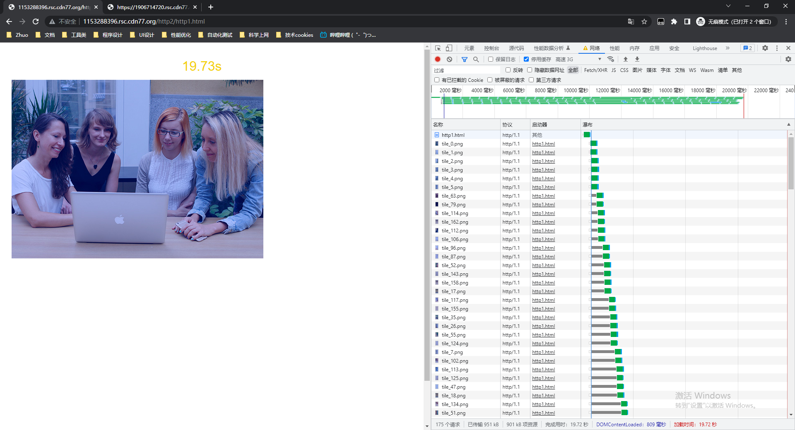
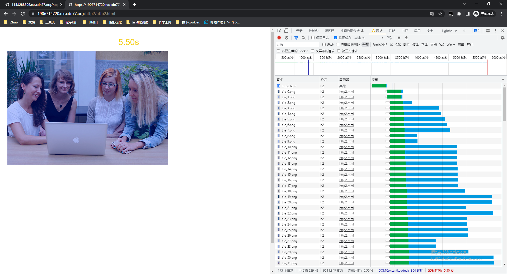
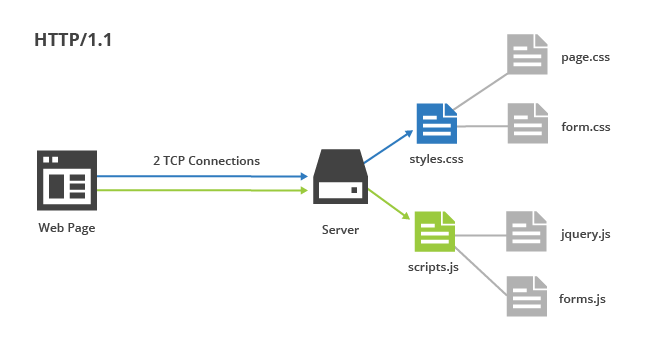
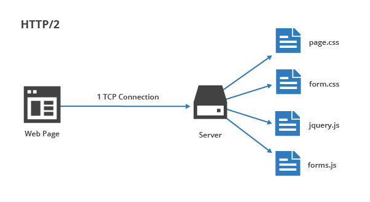
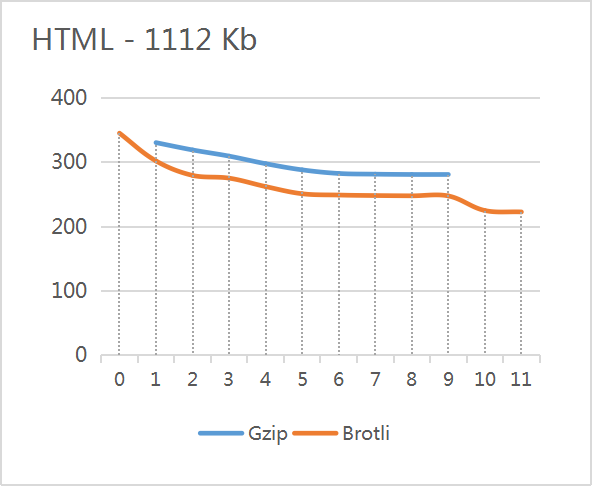
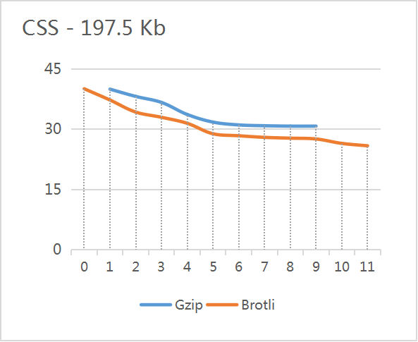
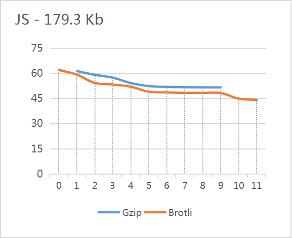
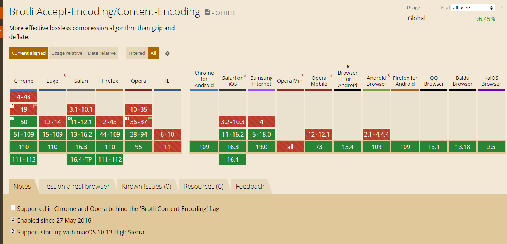

# 前端性能优化

## 图片压缩

1. ImageOptim：ImageOptim 是一种优秀的图像压缩工具，可以自动压缩图片大小，从而减小图片文件大小。
2. SVGO：SVGO 是一种优秀的 SVG 压缩工具，可以自动压缩 SVG 文件大小，从而减小文件大小。
3. PNGQuant：PNGQuant 是一种优秀的 PNG 图像压缩工具，可以自动压缩 PNG 图片，从而减小文件大小。

### webpack 插件

1. `image-webpack-loader`是一个可以处理各种图像格式的 webpack 加载器，可以压缩 PNG、JPEG、GIF 和 SVG 图像。它通过调用各种图像处理库，如 `imagemagick`、`sharp`、`libvips` 等来压缩图片。
2. `imagemin-webpack-plugin`是一个用于压缩图片的 webpack 插件，它可以自动压缩项目中的图片，支持压缩 JPEG、PNG、GIF 和 SVG 等各种图片格式。该插件使用 `imagemin` 库进行图片压缩。
3. `webpack-image-resize-loader` 是一个 webpack 加载器，它可以对图片进行缩放和裁剪，并输出多个尺寸的图片。该插件使用 `sharp` 库进行图片处理。
4. `responsive-loader`是一个可以自动将图片转换为响应式图片的 webpack 加载器。它可以根据需要生成多种尺寸的图片，并在页面中根据需要加载相应尺寸的图片，从而提高页面的加载速度。

## HTTP2

HTTP/2 是一种现代化的网络传输协议，相对于 HTTP/1.x，它提供了更快、更可靠、更安全的网络传输。

1. 多路复用：HTTP/2 使用二进制协议，支持多路复用，可以在同一个连接上并发地发送多个请求和响应，这样可以避免 HTTP/1.x 中的队头阻塞（head-of-line blocking），提高页面加载速度。
2. 服务器推送：HTTP/2 支持服务器推送（server push），即在客户端请求某个资源时，服务器可以主动将相关的其他资源一起推送给客户端，这样可以减少客户端请求的次数和延迟，提高页面渲染速度。
3. 头部压缩：HTTP/2 使用 HPACK 压缩算法对请求和响应头进行压缩，减少了数据传输的大小，降低了网络带宽的消耗，提高了页面加载速度。
4. 流量控制：HTTP/2 提供了流量控制机制，可以避免因网络拥塞而导致的延迟和连接中断，提高了网络传输的可靠性。
5. 安全性：HTTP/2 采用了 TLS 加密协议作为底层传输协议，可以提供更高的安全性，避免中间人攻击和数据泄漏。

### 基本概念

浏览器在 Network Timing 面板中会展示以下信息：

1. Queueing：指浏览器在建立 TCP 连接之前，需要等待的时间，这个时间包括前一个连接释放后的等待时间以及 DNS 解析的时间等。

2. 停顿（**Stalled**）。该请求可能因排队中描述的任何原因而停滞。

   1. stalled 时间通常会影响请求的总时间，因为请求的总时间是由各个阶段的时间相加得出的。如果 stalled 时间很长，说明网络传输或服务器响应较慢，可能需要优化网络或服务器端的性能，以减少页面加载时间，提高用户体验。

      需要注意的是，stalled 时间是浏览器测量的，因此它不一定是实际网络传输或服务器响应的时间。此外，在某些情况下，stalled 时间可能会因为浏览器或系统的其他操作（例如其他程序的使用）而增加。所以，在进行性能测试时，需要进行多次测试，以消除这些干扰因素。

3. DNS Lookup：指浏览器对主机名进行 DNS 解析的时间。

4. Initial Connection：指浏览器和服务器建立 TCP 连接所花费的时间，包括三次握手的时间。

5. SSL：指浏览器和服务器进行 SSL 握手所花费的时间（如果使用 HTTPS 协议）。

6. Request sent：指浏览器向服务器发送 HTTP 请求的时间，包括等待连接可用的时间和发送请求的时间。

7. Waiting（TTFB）：指浏览器从发送请求到接收到第一个字节的时间，也称为 Time To First Byte（TTFB）。

8. Content Download：指浏览器从接收到第一个字节到接收到响应的最后一个字节所花费的时间。

#### HTTP/2 新添加

1. Stream Start：HTTP/2 中的每个请求都被称为一个流（stream），Stream Start 表示客户端开始一个新的请求流的时间。
2. Pushed Stream：HTTP/2 中的服务器推送流（push stream）的时间。
3. Resource Hints：HTTP/2 中的服务器提示资源（resource hints）的时间。


### 实际效果对比

测试网站：http://www.http2demo.io/

#### 优化内容

根据 Google 的数据显示，HTTP/2 相比 HTTP/1.1 可以将页面加载时间缩短 50% 或以上，这个数据是通过对比在不同网络条件下加载相同的网站进行实验得出的。

在项目中带来多种性能优化，主要有以下几个方面：

1. 多路复用。
2. Header 压缩。HTTP/2 使用 HPACK 算法对请求和响应头进行压缩，减少了请求和响应头的大小，从而减少了网络传输的数据量，提高了页面加载速度。
3. 二进制协议。HTTP/2 将传输数据格式从 HTTP/1.1 的文本格式改为二进制格式，提高了传输数据的效率，减少了网络传输的数据量，从而加速了页面加载速度。


HTTP1.1 和 HTTP/2 请求速度对比图：


#### HTTP1.1

下图为HTTP1.1的图片请求，请求基本上是6个一组，然后6个完成后再 **串行请求** 下一组。



#### HTTP/2

从下方截图，可以清晰看到，所有请求基本都是并行请求，由于数据发送量较大，所以会有“等待”，这里的等待应该是数据流在客户端或服务器端重新组合的过程，正是因为这样所以单个请求时间相对更长。



### 项目改造

在使用了 HTTP/2 之后，以往项目中使用的 HTTP/1.1 的优化方式可能需要进行一些调整或改正，以充分发挥 HTTP/2 的优势，例如：

HTTP/1.1 中的大多数网站优化技术尽可能减少源服务器的 HTTP 请求数。浏览器只能同时建立有限 TCP 连接，而通过这些连接下载资源是一个线性的过程：一个资源的请求响应返回后，下一个请求才能发送。这称为队头阻塞。

因此，Web 开发人员开始将尽可能多的资源压缩到一个连接中，并寻找其他方法来避免浏览器避免队头阻塞。但在 HTTP/2 中，其中一些做法实际上会影响页面加载时间。

针对 HTTP/2 进行优化需要不同的思维方式。Web 开发人员不应担心减少 HTTP 请求，而应专注于调整其网站的缓存行为。一般规则是**运送小的、颗粒状的资源**，以便它们可以独立缓存并并行传输。


因为HTTP/2 的**多路复用**和**头部压缩功能。**

- 多路复用让多个请求共享一个 TCP 连接，允许多个资源并行下载，避免建立多个连接带来不必要的额外开销。这就消除了 HTTP/1.1 的队头阻塞问题。

- 头部压缩进一步减少了多个 HTTP 请求的损失，因为每个请求的开销小于未压缩的 HTTP/1.1 等价物。

HTTP/2 的另外两个功能也改变了处理 Web 优化的方式：**请求优先级**和**服务器推送**。前者让浏览器指定它们想要接收资源的顺序，后者让服务器发送浏览器还不知道它需要的额外资源。

### 升级

对于老项目升级到 HTTP/2，需要注意以下几个方面：

1. 升级服务器：HTTP/2 需要使用支持 HTTP/2 协议的服务器，如 Nginx、Apache、IIS 等。因此需要升级服务器软件，并配置相应的证书，以支持 TLS 加密协议。
2. 升级客户端：HTTP/2 需要使用支持 HTTP/2 协议的客户端，如浏览器、HTTP 库等。因此需要升级客户端软件，以支持 HTTP/2 协议。
3. 支持 ALPN：ALPN 是 TLS 的一个扩展协议，用于协商客户端和服务器使用的应用层协议，如 HTTP/1.1 或 HTTP/2。因此需要确保服务器和客户端都支持 ALPN，以确保能够协商使用 HTTP/2 协议。
4. 调整流控参数：HTTP/2 提供了流量控制机制，用于控制请求和响应的数据流量。但由于老项目中可能存在一些性能较差的设备或网络，因此可能需要调整流控参数，以确保能够兼容老设备或网络。
5. 去除优化：在升级到 HTTP/2 后，可能需要去除一些针对 HTTP/1.x 的优化措施，如资源合并、内联资源、压缩文件、延迟加载等，以充分发挥 HTTP/2 的优势。
6. 监测性能：升级到 HTTP/2 后，需要进行性能监测和测试，以确保能够充分发挥 HTTP/2 的优势，并解决可能出现的性能问题。

综上所述，升级老项目到 HTTP/2 需要进行一些配置和调整，并进行性能监测和测试，以确保能够充分发挥 HTTP/2 的优势，并提高页面加载速度和用户体验。


#### 停止合并资源

在 HTTP/1.1 中，由于浏览器对同一域名下的请求数量有限制，因此常常需要将多个 CSS、JavaScript 等资源合并成一个文件，以减少请求数量。但在 HTTP/2 中，由于支持多路复用，可以在同一连接上并发发送多个请求和响应，因此不再需要合并资源，反而可能会影响并发请求的效率。



因此在HTTP/2 中，合并文件不再是最佳实践。虽然它可以提高压缩率，但也会提高缓存失效的几率。因为只更改一行 CSS，对于浏览器也需要重新加载 CSS 文件。



Web开发者应该更加专注于缓存策略优化，而不是压缩文件。将经常改动和不怎么改动的文件分离开来，就可以尽可能利用CDN或者用户浏览器缓存中已有的内容。

#### 停止内联资源

在 HTTP/1.1 中，为了减少请求数量，有时候需要将一些小的图片或 CSS 内联到 HTML 中。但在 HTTP/2 中，由于支持多路复用和服务器推送，可以避免多余的请求数量，因此不再需要内联资源。需要去掉以前对小图片、内联 CSS 等的操作。

#### 压缩文件

在 HTTP/1.1 中，由于网络带宽受限，需要对文本文件进行压缩以减少传输的数据量。在 HTTP/2 中，由于支持首部压缩，可以减少传输的数据量，因此可能不需要对文件进行压缩。

#### 延迟加载

在 HTTP/1.1 中，由于队头阻塞的问题，有时候需要使用延迟加载的方式来提高页面的渲染速度。但在 HTTP/2 中，由于支持多路复用和服务器推送，可以避免队头阻塞的问题，因此可能不需要使用延迟加载。

#### 请求优先级

HTTP2可以通过设置优先级来控制静态资源的响应顺序，以提高性能。优先级可以分为高、中、低三个等级，其中高优先级的资源会优先响应，而低优先级的资源会最后响应。


#### 降低性能的场景

1. 如果网站的内容太多，而服务器的带宽太小，那么使用 HTTP2 可能会导致加载速度降低。
2. 如果网站的内容太复杂，而服务器的处理能力太低，那么使用 HTTP2 也可能会导致加载速度降低。


## 网络传输 —— Brotli 压缩算法

GZIP 压缩是实现此目的的一种方法，但 [Brotli 压缩](https://www.brotli.org/) 是另一种值得关注的新兴方法，**Brotli是专门为网络设计的**。

### Gzip

**Gzip 基于 DEFLATE 算法，它是 LZ77 和霍夫曼编码的组合**，最早用于 UNIX 系统的文件压缩。HTTP 协议上的 Gzip 编码是一种用来进 Web 应用程序性能的技术，Web [服务器](https://cloud.tencent.com/product/cvm?from=10680)和客户端（浏览器）必须共同支持 Gzip，当下主流的浏览器都是支持 Gzip 压缩，包括 IE6、IE7、IE8、IE9、FireFox、Google Chrome、Opera 等。

### Brotli

Brotli 是 Google 推出的一种新的压缩算法，相比 gzip 有更高的压缩率和更低的传输延迟。**特别侧重于HTTP压缩**。

**Brotli 通过变种的 LZ77 算法、Huffman 编码以及二阶文本建模等方式进行数据压缩，与其他压缩算法相比，它有着更高的压缩效率**。

与常见的通用压缩算法不同，Brotli 使用一个预定义的120千字节字典。该字典包含超过13000个常用单词、短语和其他子字符串，这些来自一个文本和HTML文档的大型语料库。预定义的算法可以提升较小文件的压缩密度。

Brotli 压缩算法具有多个特点，最典型的是以下 4 个：

- 针对常见的 Web 资源内容，Brotli 的性能相比 Gzip 提高了 17-25%；
- 当 Brotli 压缩级别为 1 时，压缩率比 Gzip 压缩等级为 9（最高）时还要高；
- 在处理不同 HTML 文档时，Brotli 依然能够提供非常高的压缩率。
- 比其他算法提供更快的解压与压缩算法

### 体积压缩结果

所有文件体积都为 KB

#### Gzip 

| 压缩等级 | HTML File 1   | HTML File 2  | CSS File 1   | CSS File 2   | JS File 1    | JS File 2    |
| -------- | ------------- | ------------ | ------------ | ------------ | ------------ | ------------ |
| 不压缩   | 1112          | 97.2         | 197.5        | 151.1        | 89.5         | 179.3        |
| 1        | 330.9 (70.2%) | 24.1 (75.2%) | 40 (79.7%)   | 23.7 (84.3%) | 36 (59.8%)   | 61.3 (65.8%) |
| 2        | 319.5 (71.3%) | 23.4 (75.9%) | 38.2 (80.7%) | 23.5 (84.4%) | 34.8 (61.1%) | 59.1 (67%)   |
| 3        | 309.9 (72.1%) | 22.8 (76.5%) | 36.7 (81.4%) | 23.1 (84.7%) | 33.9 (62.1%) | 57.4 (68%)   |
| 4        | 298.1 (73.2%) | 21.6 (77.8%) | 33.7 (82.9%) | 21.3 (85.9%) | 32 (64.2%)   | 54.2 (69.8%) |
| 5        | 288.5 (74.1%) | 20.7 (78.7%) | 31.8 (83.9%) | 21 (86.1%)   | 31 (65.4%)   | 52.4 (70.8%) |
| 6        | 282.9 (74.6%) | 20.6 (78.8%) | 31.1 (84.3%) | 20.8 (86.2%) | 30.8 (65.6%) | 51.9 (71.1%) |
| 7        | 281.8 (74.7%) | 20.5 (78.9%) | 30.9 (84.4%) | 20.8 (86.2%) | 30.8 (65.6%) | 51.7 (71.2%) |
| 8        | 281.3 (74.7%) | 20.5 (78.9%) | 30.8 (84.4%) | 20.7 (86.3%) | 30.8 (65.6%) | 51.6 (71.2%) |
| 9        | 281.3 (74.7%) | 20.5 (78.9%) | 30.8 (84.4%) | 20.7 (86.3%) | 30.8 (65.6%) | 51.6 (71.2%) |

#### Brotli 

| 压缩等级 | HTML File 1   | HTML File 2  | CSS File 1   | CSS File 2   | JS File 1    | JS File 2    |
| -------- | ------------- | ------------ | ------------ | ------------ | ------------ | ------------ |
| 不压缩   | 1112          | 97.2         | 197.5        | 151.1        | 89.5         | 179.3        |
| 0        | 345.6 (68.9%) | 23.3 (76%)   | 40.1 (79.7%) | 25.7 (83%)   | 37.2 (58.4%) | 62 (65.4%)   |
| 1        | 302.4 (72.8%) | 22.2 (77.2%) | 37.3 (81.1%) | 21.8 (85.6%) | 35.7 (60.1%) | 59.2 (67%)   |
| 2        | 279.9 (74.8%) | 20.9 (78.5%) | 34.3 (82.6%) | 20.6 (86.4%) | 33 (63.1%)   | 54.3 (69.7%) |
| 3        | 275.6 (75.2%) | 20.4 (79%)   | 33 (83.3%)   | 20.4 (86.5%) | 32.8 (63.4%) | 53.3 (70.3%) |
| 4        | 262.5 (76.4%) | 19.2 (80.2%) | 31.5 (84.1%) | 19.8 (86.9%) | 31.9 (64.4%) | 52 (71%)     |
| 5        | 251.3 (77.4%) | 18.2 (81.3%) | 28.9 (85.4%) | 19.1 (87.4%) | 30.3 (66.1%) | 49 (72.7%)   |
| 6        | 249.3 (77.6%) | 18.1 (81.4%) | 28.4 (85.6%) | 19.1 (87.4%) | 30.1 (66.4%) | 48.6 (72.9%) |
| 7        | 248.5 (77.7%) | 18.1 (81.4%) | 28 (85.8%)   | 19.1 (87.4%) | 30.1 (66.4%) | 48.3 (73.1%) |
| 8        | 248.1 (77.7%) | 18.1 (81.4%) | 27.8 (85.9%) | 19.1 (87.4%) | 30 (66.5%)   | 48.3 (73.1%) |
| 9        | 247.9 (77.7%) | 18 (81.5%)   | 27.6 (86%)   | 19 (87.4%)   | 30 (66.5%)   | 48.2 (73.1%) |
| 10       | 225.2 (79.7%) | 16.1 (83.4%) | 26.5 (86.6%) | 17.5 (88.4%) | 28.4 (68.3%) | 44.9 (75%)   |
| 11       | 223 (79.9%)   | 15.8 (83.7%) | 25.9 (86.9%) | 17.2 (88.6%) | 28 (68.7%)   | 44.2 (75.3%) |







Brotli 采用与 Gzip 使用相同的技术，并使用现代方法对其进行增强：

- HTML 文件比 Gzip 小 21%
- CSS 文件比 Gzip 小 17%
- JavaScript 文件比 Gzip 小 14%

**Brotli的压缩速度不仅比gzip快，还能得到更小的文件。**

### 传输对比

| 压缩算法  | 请求数/s | 传输的字节数 (MB/s) | 最大的 RSS (MB) | 平均延迟 (ms) |
| --------- | -------- | ------------------- | --------------- | ------------- |
| br-stream | 203      | 0.25                | 3485.54         | 462.57        |
| lzma      | 233      | 0.37                | 330.29          | 407.71        |
| gzip      | 2276     | 3.44                | 204.29          | 41.86         |
| none      | 4061     | 14.06               | 125.1           | 23.45         |
| br-static | 4087     | 5.85                | 105.58          | 23.3          |


### Brotli 兼容性

主流浏览器基本上都支持了。



### 服务器支持 Brotli 

支持Brotli压缩算法的浏览器使用的内容编码类型为  `br`

http请求头：`Accept-Encoding: gzip, deflate, sdch, br`

http返回头：`Content-Encoding: br`


### 在 Nginx 上启用 Brotli

nginx 目前并不支持 Brotli 算法，需要使用第三方模块，例如 [ngx_brotli](https://github.com/google/ngx_brotli) 进行实现。

下面是简单的安装步骤：

```shell
git clone https://github.com/google/ngx_brotli
cd ngx_brotli
git submodule update --init
cd /path/to/nginx_source/
./configure --add-module=/path/to/ngx_brotli
make && make install
```

或者使用现有镜像 [fholzer/nginx-brotli](https://hub.docker.com/r/fholzer/nginx-brotli) 制作项目镜像脚本：

```dockerfile
FROM fholzer/nginx-brotli:v1.21.6

RUN mkdir -p /webui
COPY ./dist  /webui

CMD ["-g", "daemon off;"]
```


### 前端支持 .br 

前端产物支持 br 产物为非必须项，但建议处理。当浏览器请求 `.js` 文件时，如果服务器上存在对应的 `.js.gz` 文件，Nginx 就会直接返回该文件，避免浪费带宽和时间将未压缩的文件传输到客户端。

webpack 配置：

```js
// npm i compression-webpack-plugin -D

const CompressionPlugin = require('compression-webpack-plugin');
const zlib = require('zlib'); // node 自带库。只要版本不是太低（> 11 ?）就有

// plugins: [{...

new CompressionPlugin({
    filename: '[path][base].br',
    algorithm: 'brotliCompress',
    test: /\.(js|css|html|svg)$/,
    compressionOptions: {
        params: {
            [zlib.constants.BROTLI_PARAM_QUALITY]: 11,
        },
    },
    threshold: 10240,
    minRatio: 0.8,
})

// }],
```


### Nginx 配置

http 配置添加一下内容

```nginx

# ...
http {

    brotli               on;
    brotli_comp_level    4;
    brotli_buffers       16 8k;
    brotli_min_length    20;
    brotli_types 		 text/plain text/css application/javascript application/json image/svg+xml application/xml+rss;
    
    # gzip 配置保留。为了兼容性考虑，通常需要同时提供 Brotli 和 gzip 格式的压缩文件，以便浏览器选择适合自己的压缩格式进行下载。
    gzip on;
}

# ...
```

#### brotli

响应是否即时压缩，值：`on|off`。

#### brotli_static

检查 .br 预压缩文件的存在，值：`on|off|always`。设置了 always ，不检查客户端是否支持 `br`，直接使用预压缩文件。

#### brotli_types

对指定的MIME类型的响应进行即时压缩。

像JPEG、PNG、MP4这样的二进制文件，已经用特定格式的压缩方式压缩过了，比 gzip 和 brotli 的压缩方式要好。

对PNG进行 `gzip` 或 `brotli` 是没有意义的：PNG已经被压缩了，它将变得更大而不是更小。

所以要使用`brotli_types text/plain text/css application/javascript application/json image/svg+xml application/xml+rss`
涵盖HTML（默认包含）、纯文本、JavaScript、JSON、SVG和RSS。

#### brotli_comp_level

设置即时压缩 Brotli 压缩级别，值范围：`0~11`。在 nignx 上配置的 brotli 等级的策略：

- 对于静态资源，使用 11 来压缩它们得到预压缩的 .br 文件 —— 因为服务器在响应请求时会优先读取 .br 文件，这样就可以为每个请求立即提供文件。
- 对于动态内容，使用 4，它压缩所需要的时间和文件压缩比是平衡的，既不会导致过长的响应时间又能保证文件体积不大。

#### 对接口的影响

如果后端服务（响应头）接口已经添加了 `gzip` ，那么 `nginx`不会以`brotli`方式重新压缩。

在后端服务器上禁用`gzip`，在nginx上使用`brotli`。

