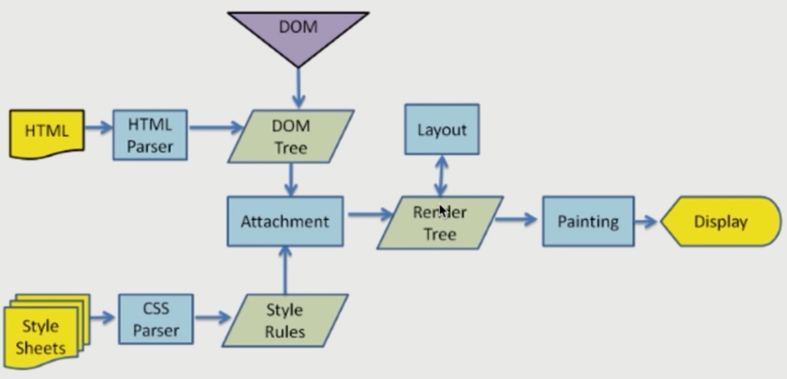

# 渲染机制类

问题：

- 什么是DOCTYPE及作用
- 浏览器渲染过程
- 一个页面从输入 URL 到页面加载显示完成，这个过程中都发生了什么？
- 重排 Reflow
- 重绘 Repaint
- 布局 Layout

----

### 什么是DOCTYPE及作用

> DTD（document type definition ，文档类型定义）是一系列的语法规则，用来定义XML或（X）HTML的文件类型。浏览器会使用它来判断文档类型，决定使用何种协议来解析，以及切换浏览器模式。
>
> DOCTYPE是用来声明文档类型和DTD规范的，一个主要的用途便是文件的合法性验证。如果文件代码不合法，那么浏览器解析时便会出一些差错。

### 浏览器渲染过程

### 一个页面从输入 URL 到页面加载显示完成，这个过程中都发生了什么？

- 分为4个步骤：
  1. 当发送一个URL请求时，不管这个URL是Web页面的URL还是Web页面上每个资源的URL，浏览器都会开启一个线程来处理这个请求，同时在远程DNS服务器上启动一个DNS查询。这能使浏览器获得请求对应的IP地址。
  2. 浏览器与远程`Web`服务器通过`TCP`三次握手协议来建立一个`TCP/IP`连接。该握手包括一个同步报文，一个同步-应答报文和一个应答报文，这三个报文在 浏览器和服务器之间传递。该握手首先由客户端尝试建立起通信，然后服务器应答并接受客户端的请求，最后由客户端发出该请求已经被接受的报文。
  3. 一旦`TCP/IP`连接建立，浏览器会通过该连接向远程服务器发送`HTTP`的`GET`请求。远程服务器找到资源并使用HTTP响应返回该资源，值为200的HTTP响应状态表示一个正确的响应。
  4. 此时，Web服务器提供资源服务，客户端开始下载资源。
- 请求返回后，便进入了我们关注的前端模块
  1. 简单来说，浏览器会解析`HTML`生成`DOM Tree`，
  2. 其次会根据`CSS`生成`CSS Rule Tree`，
  3. 而`JavaScript`又可以根据`DOM API`操作`DOM`

### 重排 Reflow

> DOM结构中的各个元素都有自己的盒子（模型），这些都需要浏览器根据各种样式来计算并根据计算结果将元素放在它该出现的位置，这个过程称之为reflow

触发Reflow

- 当增加、删除、修改DOM节点时，会导致Reflow 或 Repaint
- 当移动DOM的位置，或是搞个动画的时候
- 当修改CSS样式的时候
- 当Resize窗口的时候（移动端没有这个问题），或是滚动的时候
- 当你修改网页的默认字体时（会造成严重的reflow，禁止进行这种操作）

### 重绘 Repaint

> 当各种盒子的位置、大小以及其他属性，例如颜色、字体大小等都确定下来后，浏览器于是便把这些元素都按照各自的特性绘制了一遍，于是页面的内容出现了，这个过程称之为repaint

触发Repaint

- DOM改动
- CSS改动

### 布局 Layout