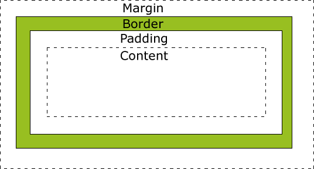
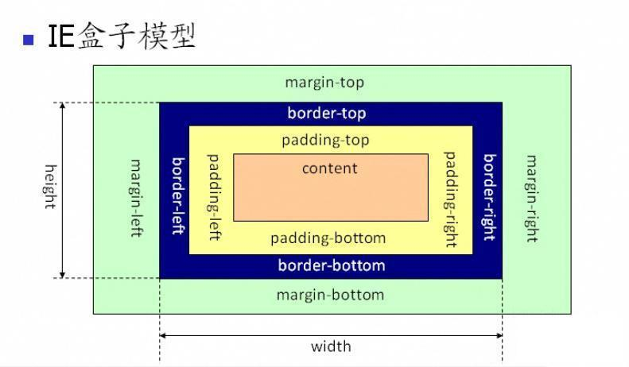

# CSS盒模型

**问题（从上之下，逐步深入）：**

- 基本概念：标准模型 + IE 模型
- 标准模型与 IE 模型的区别
- CSS如何设置这两种模型
- JS如何设置获取盒模型对应的宽和高
- 实例题（根据盒模型解释边距重叠）
- BFC（边距重叠解决方案）

------

### 基本概念与区别：

- 标准模型

  

  > 在标准盒模型中：盒子占位= width + 2*margin + 2*padding + 2*border，高度与之一样。 

- IE模型

  

  > 在IE模型中，盒子占位=width + 2*margin

### CSS 如何设置这两种模型：

```css
box-sizing: content-box; /* 默认值。标准盒子模型 */
box-sizing: border-box;  /* IE模型 */
```
### JS如何设置获取盒模型对应的宽和高：

```js
dom.style.width/height; // 只能获取CSS的内联属性
dom.currentStyle.width/height; // 能获取三种方式（内联，外链，内嵌）的CSS样式，
							//  但这个属性只有IE支持
window.getComputedStyle(dom).width/height; // 兼容chrome，firefox
dom.getBoundingClientRect().width/height; // 
```

### 实例题（根据盒模型解释边距重叠）

### BFC（边距重叠解决方案）：

- BFC的基本概念：

  > BFC(Block formatting context)直译为"块级格式化上下文"。 

- BFC的原理：

  1. 内部的Box会在垂直方向，一个接一个地放置。
  2. Box垂直方向的距离由margin决定。属于同一个BFC的两个相邻Box的margin会发生重叠
  3. 每个元素的margin box的左边， 与包含块border box的左边相接触(对于从左往右的格式化，否则相反)。即使存在浮动也是如此。
  4. BFC的区域不会与float box重叠。
  5. BFC就是页面上的一个隔离的独立容器，容器里面的子元素不会影响到外面的元素。反之也如此。
  6. 计算BFC的高度时，浮动元素也参与计算

- 如何创建BFC：

  1. 根元素，即HTML元素
  2. float的值不为none
  3. overflow的值不为visible
  4. display的值为inline-block、table-cell、table-caption
  5. position的值为absolute或fixed

- BFC的使用场景：

  1. 自适应两栏布局
  2. 可以阻止元素被浮动元素覆盖
  3. 可以包含浮动元素——清除内部浮动
  4. 分属于不同的BFC时可以阻止margin重叠