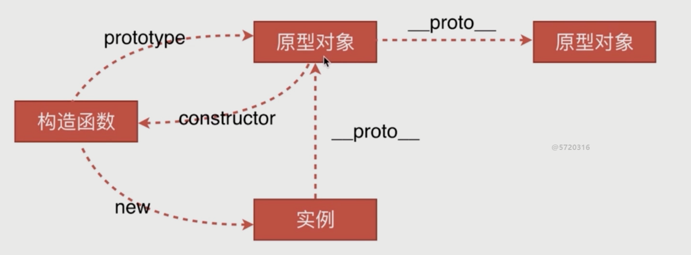
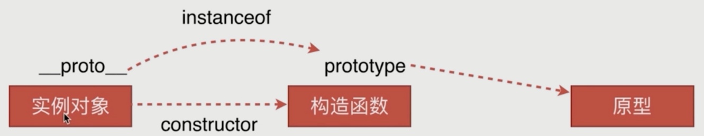

# 原型链类

问题：

- 创建对象有几种方法
- 原型、构造函数、实例、原型链
- `instanceof`的原理
- `new`的原理
- 说说你对作用域链的理解

------

### 创建对象有几种方法

```js
// 第一种
var obj = {name: 'z'}
var obj2 = new Object({name: 'z'})
// 第二种
var Foo = function(){ this.name = 'z' }
var obj2 = new Foo()
// 第三种
var obj = {name: 'z'}
var obj2 = Object.create(obj)
```
### 原型、构造函数、实例、原型链




### `instanceof`的原理



### `new`的原理

```js
var new2 = function(func){
    var o = Object.create(func.prototype)
    var k = func.call(o)
    if(typeof k === 'object'){
        // 如果func返回的是一个对象，则返回这个对象
        return k
    } else {
        // 反之，则返回 o
        return o
    }
}
```

### 说说你对作用域链的理解

- 作用域链的作用是保证执行环境里有权访问的变量和函数是有序的；
- 作用域链的变量只能向上访问，变量访问到`window`对象即被终止，作用域链向下访问变量是不被允许的。