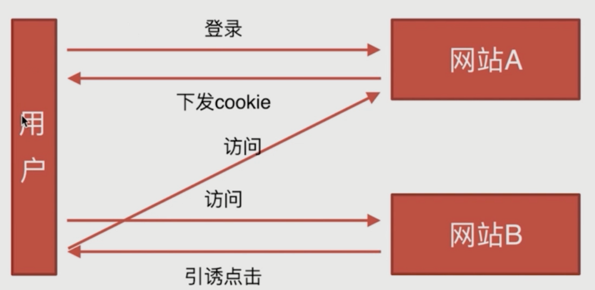

# 安全类

问题：

- CSRF
- XSS

------

### CSRF

- 基本概念和缩写

  > CSRF，通常称为跨站请求伪造，英文名 Cross-site request forgery

- 攻击原理

  

- CSRF 防御措施

  1. Token验证
  2. Referer验证
  3. 隐藏令牌

### XSS

- 基本概念和缩写

  > XSS（cross-site scripting）， 跨域脚本攻击。 

- 攻击原理

  直接向页面注入脚本，不需要用户登录