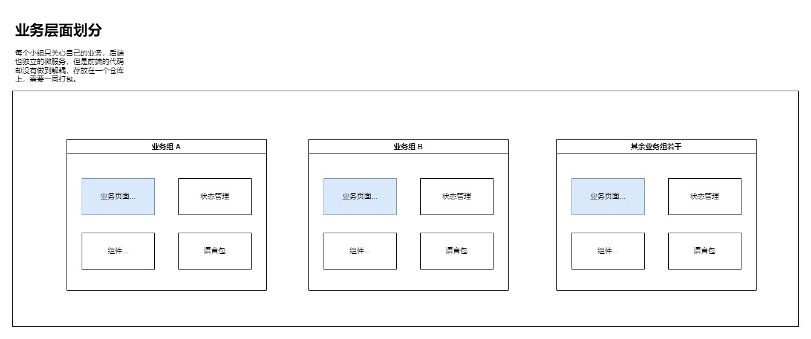
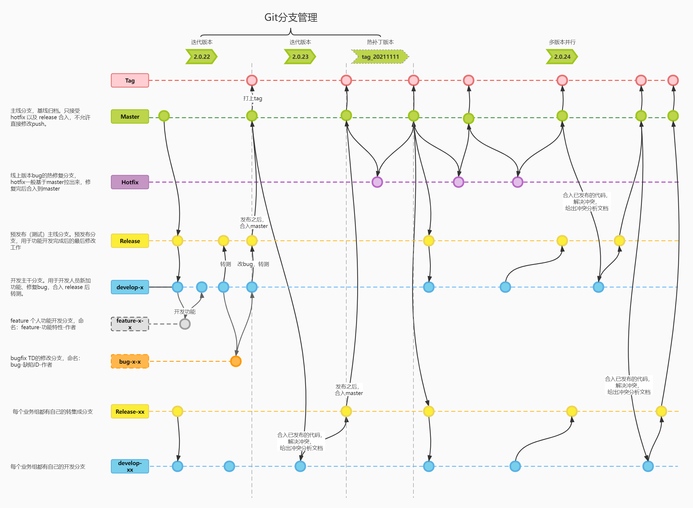
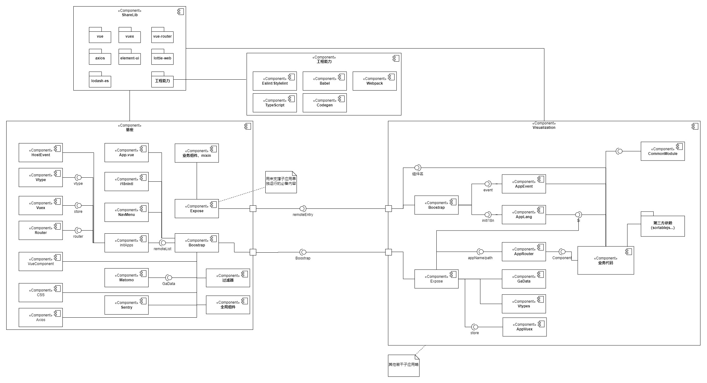

# 微前端在核心项目的实践——设计篇

> 更新计划

本文只涉及到 `module-federation`微前端方案的设计层面分享，关于具体实现，可以参考写的[简单例子](https://github.com/zhuoooo/microservices)；所有的[设计图](https://github.com/zhuoooo/design-diagram/blob/main/%E5%BE%AE%E6%9C%8D%E5%8A%A1%E8%AE%BE%E8%AE%A1%E5%9B%BE.drawio)自取，如果对你有一些启发，请点个 star

## 背景

团队从瀑布流模式转变为敏捷模式，将整个项目团队划分为多个小组并行开发，多小组同时升级的分支处理和代码冲突之类的问题频繁出现。于是接到了组内一个技术需求：《模块支持单独升级和部署》。目前，我们开发和维护代码的现状：

- 一个仓库包含了所有的业务组的前端代码
- 只能一起打包出一个整包，也无法单独部署
- 后端已完成微服务的拆分

如上所述，虽然一般场景通过 git 多分支管理能解决【独立开发】和【发布】的问题，但是一遇到【多团队同时发布】的场景就让人头疼了：

- 需要拉上各个团队的负责人，反复确认当天能否正常上线
- 上线分支排列组合（release-a、release-b、release-ab ）预防某一个团队突发问题不上线
- 测试工作量增加：原本只要验收一个代码包，现在还要验证多个代码包功能（> 1）

看一眼分支模型：

既然提出了已有问题，为了解决这些问题，我们意识到和后端一样将整个项目拆分成若干的子应用，将它们也变成微服务，不就可以解决目前的困境了吗？自然而然我们就想到了“微前端”的概念。有目标，就好发力了，我们参考了业务优秀方案，同时结合了自身实际情况，最终决定用`webpack5 module federation `特性来进行微前端的实践与落地。

## 需求分析

## 方案选择

## 微前端实践

## 微前端下的架构变化

## 部署方案

