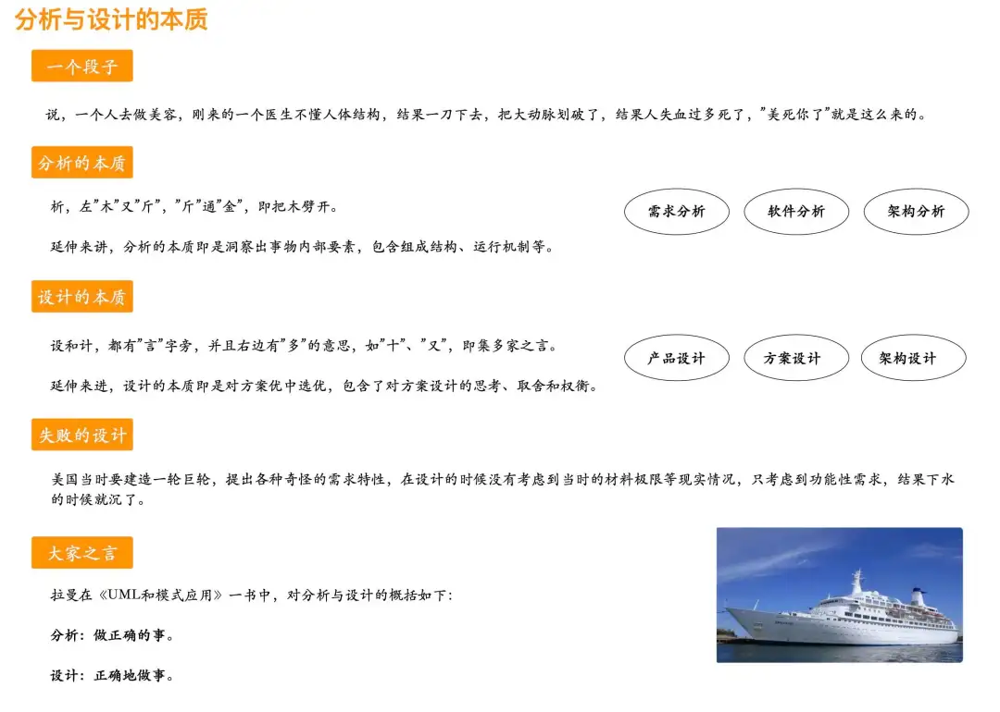
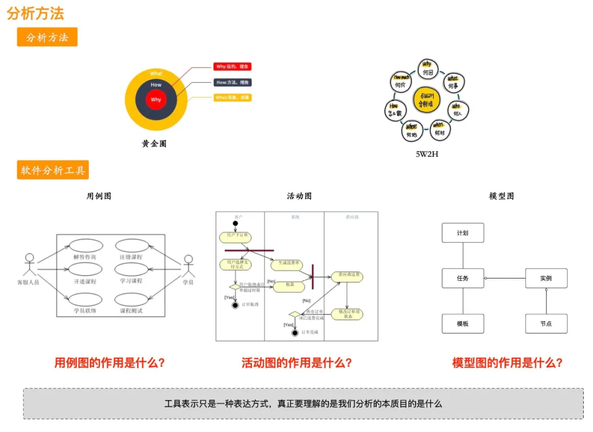
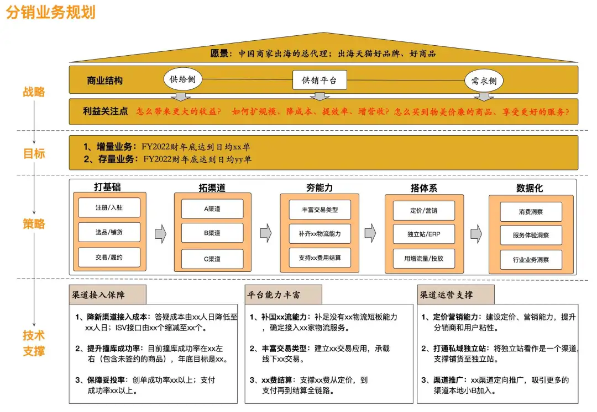
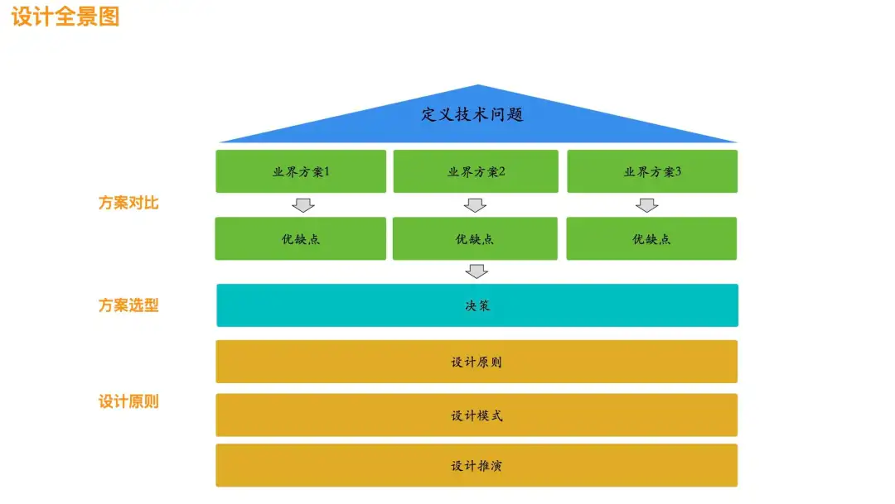
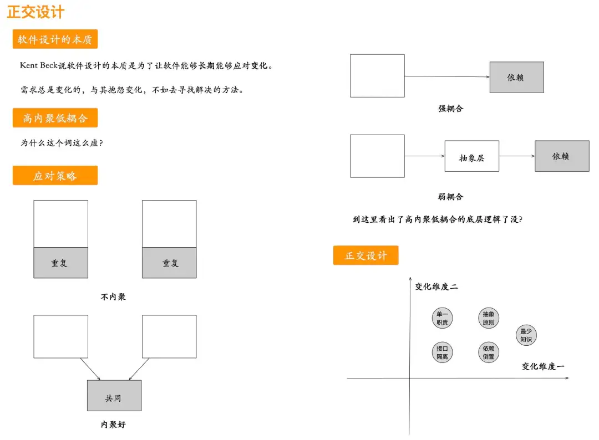

# 软件分析与设计：分析什么？如何设计？

> 分析与设计这两个词我们平时经常听到，也经常讲，那么分析与设计的本质究竟是什么呢？到底要分析什么？又到底要怎样去设计？这3个问题如果平时没有一些积累，突然被问到这些，一时也会显得不知所措。接下面在第一部分中回答分析与设计的本质，只有清楚了本质，那就知道要怎么分析与设计，因此在第二、第三部分具体讲软件的分析与设计方法，最后一部分讲述个人的一些思考。

### 一 分析与设计的本质

#### 1 分析的本质

"分析"，由"分"和"析"两个字组成，"分"是分开的意思，这个比较好理解；"析"，左"木"又"斤"，"斤"通"金"，即把木劈开。延伸来讲，分析的本质即是洞察出事物的内部要素，包含组成结构、运行机制等。平时开发同学经常看到"需求分析"、"软件分析"、"架构分析"这些词，以"需求分析"为例，分析阶段要了解的内容有：需求背景、需求目的、需求目标、利益相关方、业务流程、业务依赖方、业务指标。分析的目的是为了找出隐藏在现象背后的本质，考察的是否对事物打散认识，深入到事物内部去看问题，就像我们高中学习化学一样，分子结构决定表现现象。在实际软件开发中，产品同学提的一个需求，有时它就包含了技术解决方案，只有深入分析之后，开发同学有可能提出更为合理的技术解决方案，否则只是就事论事的解决问题，在新的场景下，现有的解决方案又有问题。

有一个段子说一个人去做美容，刚来的一个医生不懂人体结构，结果一刀下去，把大动脉划破了，结果人失血过多死了，"美死你了"这个词就是这么来的。段子归段子，这也说明如果分析没有做得相当充分，也即缺乏对事物的了解，往往做事会出错。

#### 2 设计的本质

"设"和"计"两个字都有"言"字旁，并且右边有"多"的意思，如"十"、"又"，即集多家之言。延伸来讲，设计的本质即是对方案优中选优，包含了对方案设计的思考、取舍和权衡。只有了解了当时的设计思想才会比较快掌握是怎样实现的，在软件编码实现层面上，我们有时看到一些比较难理解的逻辑，这些逻辑就是当时设计的产物，在当时是为了解决特定的问题产生的。

一个好的设计凝集了设计者的思想和心血，比如经典的文学著作，里面有优秀的写作手法；比如经典的影视桥段，里有精彩的故事情节；比如巧夺天工的建筑设计，里面有丰富的寓意。相反一个糟糕的设计，轻则让人迷惑，看不懂为什么要这么设计，影响美观、使用，重则产生事故，在《复杂系统的产品设计与开发》一书中，作者举了一个轮船的例子，当时建造轮船提了很多要求，在面对这么复杂的系统时，设计没有考虑周全，结果设计出来的轮船下水就沉了。

拉曼《UML和模式应用》一书中，对分析与设计概括成：分析是做正确的事；设计是正确地做事，之前看到这2句话挺迷糊，并没有领会到这两句的精髓，后面经历了一些系统的设计之后，重新去看发现这2句话高度概括出了分析与设计的本质内涵。

### 二 到底要分析什么

#### 1 分析全景图

分析的起点是问题本身，比如现象、痛点、挑战、价值等，从这些基础点去分析，如分析一个业务时，我喜欢从业务愿景和业务目标去看这个业务有哪些利益相关者，也即有哪些角色在使用这个业务，从这些利益相关者的角度去思考他们的本质诉求，正是**他们的诉求构成了我们要做什么的输入，不管外部怎么变化，他们的本质诉求是不变的**，如对于消费者来讲，他们的诉求是花最短的时间、最少的钱、更好的体验买到心仪的商品；对于商家来讲，他们的诉求是怎么卖出更多的货、怎样获得更大的利润。反而**如果我们不去关注利益关注点的本质诉求，而只是自己凭空想出来的，自以为有价值，结果一落地就出现了问题。**

当明确了要做什么(What)之后，接下来就要思考业务流程以及业务中包含的要素(业务对象)、业务模型以及业务能力(How)，实际上这部分就是提供一个解决方案去实现前面提到的诉求。分析的阶段，一定要非常细，在软件分析中，有一些分析的工具帮助我们更好地理解事物本身，具体地在下一节中讲到。分析的产物是业务模型和业务能力地图，通过业务模型可以看出业务是什么、有什么，通过业务能力地图可以看出具体的业务能力有哪些，可以支撑哪些业务场景。

分析往上看一层，就是要分析商业价值链和商业模式，虽然这一块并不是开发同学负责的范畴，了解一些还比较好，能让我们对业务有更深刻的认识，商业模式决定商业结构，商业结构决定交易结构，交易结构决定业务组成结构。利益相关者也是从业务组成结构中推导出来的，这一部分是最顶层的分析，分析业务的可行性，也即我们常说的Why。

#### 2 具体分析方法

在实际中，我们会看到各种各样的分析方法，这些方法本身并不重要，重要的是它能给我们带来什么的帮助，为什么需要它，个人的观点是分析方法不要贪多，真正融汇到实际中，有那么1、2个方法就足已，不要迷失在各种各样的分析方法中，真正还是要了解分析的本质是什么，在第一部分中，已经提到分析的本质是要洞察出事物的组成，包含组成结构和运行机制，你再去看各种各样的分析方法，它们都是为了找出事物的组成结构和运行机制。如黄金圈分析方法，它就包含了三层（Why、What、How），分析事物不断从宏观到微观、从目的到实现；再比如5W2H，真正的把一件事分析得非常仔细，什么人在什么时间什么地点因为什么做了什么事。

再回到软件分析本身，之前在大学里我们我们学习软件工程、UML等课程，由于当时并没有多少实际的研发、设计的经验，学习的时候觉得这些内容比较空洞，反正老师让我们这样做就这样做，缺乏对这些UML图的理解。

- 用例图：用户对系统最直接的交互，要表达出用户需要怎样的能力去满足他们的诉求，它的关键是用户、目的、价值。

- 活动图：用户在某一类场景中，要表达出业务流程是怎样的，它的关键是业务活动、流程交互（仅是业务层面，不是系统流程）。

- 模型图：屏蔽业务细节，抽象出业务关键要素以及它们之间的联系，它的关键是业务抽象出来的实体以有实体之间的关联。

我们现在反过来去想想当时学习的UML课程，里面各种图都是为了帮助我们更好去认识、理解项目需求，画这些图并非是做做样子，而是真正地挖掘出业务能力有哪些、系统能力有哪些、业务模型是怎样的、要有哪些对象、对象之间的关系是怎样的。在实际工作中，有些人在分析阶段在这一块落实得并不那么好，其实问几个问题很容易暴露出来，比如设计的类图的出发点是什么、这个类的职责为什么有这些、这个职责为什么在这个类而不是在另外一个类中。**如果我们分析阶段做得不扎实，设计阶段的输入就会比较少，或者是浅层次的输入，设计的质量也不会高，因为并没有真正洞察出问题。**

#### 3 1个分析案例

用2.1节中提到的分析方法，我当时分析一个分销业务也是用了上面的方法，从下面这张图中可以看出业务发展思路是怎样，用了几个关键词进行概括：打基础、拓渠道、夯能力、搭体系、数据化。当有了这些认识之后，再去推导技术侧要做哪些就比较容易，以拓展渠道为例，当多个渠道接入进来时就暴露了一些问题，比如答疑成本比较高，因此就有一个重要的方面就是渠道接入保障，怎么减少渠道接入成本、答疑成本就是技术侧要思考的问题。

### 三 到底要怎样设计

#### 1 设计全景图

如果说分析阶段是把事物打散，那么设计就是把打散的事物更好地组合起来。设计最为核心的是从分析中提炼出问题，即定义技术问题，这个是非常难的，比如你觉得某个设计不好，但又讲不出来为什么不好，说明对问题的理解程度还不高。常见的技术问题有：性能、扩展性、稳定性、安全、效能、体验、成本、数据一致性等。

当定义好了技术问题，接下来就要调研业界对这个问题有哪些方案，每个方案的优缺点是什么，比如数据一致性，有事务型解决方案，也有补偿型解决方案，结合业务本身去做选择，这个选择就包含了决策，决策就意味着取舍和平衡，并不是随意的决策，而是有决策的依据来支撑，比如经验、原则、数据等。

设计是包含原则的，这些原则应该是大家都去遵循的，比如分层原则，这个在软件设计中非常常见，原则是平时大家开发过程经验的结晶，以分层原则为例，可以深入思考，为什么要分层、分层解决了什么问题、要分多少层、如何去分层，只有深入思考了这些原则，在新的场景中再去做设计时，就会得心应手，而不是僵硬地去套用分层原则。

#### 2 设计原则

设计原则，每个设计者有自己的理解，很难有统一的设计原则，只能在局部上达成一致，比如分层原则，这个大家比较容易达成的，设计原则应该是一系列的原则组成集合，并非是单一。设计原则是在大量实践过程中沉淀出来的，我更想说的是如果你对看到的某些原则能结合自己的经历讲得出来，说明你是有过真正实践和思考的，否则这些设计原则也仅仅是一些文字，转化不了设计经验和设计能力，这里列出一些常用的设计原则。

- 系统性原则
- 抽象分层原则
- 领域原则
- 复用原则
- 简易原则
- 成本效率原则
- 正交原则
- 扩展原则
- 演进原则

#### 3 2个设计案例

对于上面提到的9个设计原则，这里主要聊的是系统性原则和正交原则，系统性原则是站在全局上思考系统之间的交互，这个是非常重要的，相当于是指明灯，当看懂了整个系统未来的样子，在当下每一步的执行都清楚知道是为了什么。反之没有这个系统性原则，所做的事都只是关注点状事情，不成体系。以2.3节中的例子来讲，当分析出来要做的事情后，如下图画出系统架构图。从系统架构图中可以看出系统之间的交互是怎样的、链路逻辑是怎样的（注：逆向链路没有表达出来）。

我们在数学中学习过正交，最简单的理解是两条线是垂直的，在软件中我们看到一些逻辑中包含了很多的逻辑，每次修改的时候，改了这个逻辑结果影响了另外一个逻辑，说明我们的逻辑耦合度比较高。正交原则即是分离出不同的变化点，让变化自治，即每个变化只影响自身，不会影响到其它的变化点。平时我们写代码中有两种场景影响正交：代码重复和关系依赖，对于重复的代码可以抽取出来，对于依赖的部分，可以抽象一层防腐层出来。

举一个正交的例子，假如有一个需求是：查找员工名为John的员工，这个代码可以很快写出来，但细细想想的它的变化点，至少可以想到下面3个变化点：

- 查找的内容会变，不一定按照名字来查，比如按照员工工号来查；

- 查找的对象会变，不一定查员工，还有可能查学生；

- 查找的规则会变，不一定是待值查找，还有可能是范围查找，比如查找年龄在20至30的员工。

当想到了这些变化，重新设计后的效果就会不一样了，当面临业务场景变化的时候，可以做到最少的改动，这也即是设计能够降本增效的原因。

### 四 分析与设计的思考

#### 1 衡量标准

衡量分析与设计的标准是比较难的，一般是从一些大的原则去看，比如复杂性、开放性等，但又很难有一个量化的指标去衡量，到底复杂度有多高、开放性有多底。真正衡量好坏只有通过比较才比较好判断，比如多个方案之间的比较，这个是比较容易衡量谁好。因此我们需要多去看别人是怎么设计的，有哪些好的设计思想值得借鉴，多吸收好的设计思想、设计案例。

做设计最怕是闭门造车，结果设计出来的东西不能够很好地解决实际问题。个人的经验是去看业界的方案，看看它们是怎么设计的，各自的特点，比如数据不一致性的问题，有很多种设计方案来解决，有的方案对业务入侵比较大，需要改造很大，能不能无入侵业务呢？阿里提出了TXC解决方案，这个设计就非常好，使用者只有打上一个注解就ok，对业务改造没有什么成本，这也即是前面提到的简易设计原则。

#### 2 虚实结合

提到分析与设计，很多人觉得很虚，的确，在我刚工作前3年，也觉得这个非常虚，这个不就是画画图嘛，后面发现还真不是这么一回事。印象最深的一件事，当时在滴滴，我的主管给我们展示了营销系统未来我们要做的事，用了一张系统架构图非常体系地讲出来，知道未来我们要做成什么样子，当前我们处在什么位置上，那段时间我们过得非常充实，知道我们在做什么、要做什么，1年半以后我们把当时那张系统架构图上的事情都完成了，回过来头来看，如果没有当时的指引，每天还是做着需求，来一个需求做一个需求，这也即是最开始做事没啥动力，没看到目标。

当设计的内容确定之后，最为重要的就是落实，这个过程是经验的积累，在实践的过程中会遇到一些问题，比如发放优惠券的过程中怎么扣库存、怎么保持事务一致性，技术难度的问题，我听一个人讲过一句话：要么没看到问题；要么回避问题，在实际中，我们会遇到各种各样的问题，只是我们把它忽略掉了，到最后说这个事技术上没复杂度。我经常分享的一个观点是往上抽象看2层，或许你的设计方案会变。架构设计是需要大量的实实在在的经验，不是简单地画画架构图就行了，需要在实践中反复检验，再去指导下一次更好地设计，我欣赏的一句话是：将虚的事情做实。

#### 3 将经验转化成能力

当我们有一些分析设计经验之后，更进一步地要转化成设计能力，设计能力是抽象的，需要在实际中得到检验。就像在第三部分讲到的设计，它不像分析那么很好地讲出具体的方法出来，设计本身是凝聚了思想、心血在里面，同时设计是一种艺术，具有高度的灵活性，因此很难讲出具体的设计方法，也不会有统一的方法，有灵活性一定不是具体的，所以这部分需要在大量的实践基础上，提炼出设计原则，将其转化成设计能力。