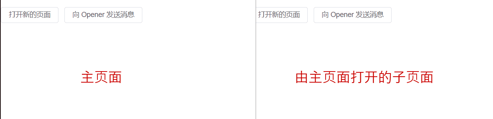

# 《关于在A页面操作B页面刷新数据这件事》

> 这里是突然勤奋的 Zhuo，持续更新文档中。


## 需求

“小Z，你说能不能做到在 A 页面新增一个数据之后，B 页面也同步刷新，出现刚才新增的那个数据呢? ” PO 对着我说。

“可以是可以，但是...” 我正准备说。

“我就知道你行，我这个版本有一个交互优化点，你来看看。” PO 满脸坏笑。

“....” 


“纯前端可以实现，但是有局限。B 页面只能由 A 页面打开的，而且需要 B 页面支持一些功能，所以 B 页面最好是我们系统内部的。” 我说

“这也行吧” PO


## 效果




## 分析

### 方案对比

| 方案                | 优点                                                         | 缺点                                                         | 备注 |
| ------------------- | ------------------------------------------------------------ | ------------------------------------------------------------ | ---- |
| 通过回调函数        | 简单粗暴                                                     | 1. 需要主页面全局注册函数，不利于扩展<br />2. 依赖 opener，一旦主页面将它设置为空则获取不到内容了 |      |
| 监听 `localStorage` | 满足基本需求                                                 | 需要两个页面都满足同源策略条件                               |      |
| `WebSocket` 服务    | 1. 不仅能跨窗口，还可以跨浏览器，甚至跨账号                  | 1. 需要服务端参与<br />2. 所有的页面都会收到事件             |      |
| `message` 事件      | 1. 不需要页面同源<br />2. 只要约定好传递的信息，即使不同系统也能通信 | 1. 不同系统之间需要约定好传递的内容                          | 采用 |


### 通过回调函数

1. 首先，在主页面的 window 上注册一个全局函数 `callback`；
2. 接着，从系统中打开一个子页面 `window.open(href, '_blank')` ；
3. 最后，通过子页面 `window.opener.window.callback()`进行函数调用

先讲一下 `window.opener`：**返回打开当前窗口的那个窗口的引用，例如：在window A中打开了window B，B.opener 返回 A**  ；

这个方案的实现是利用了 `window.opener`的特性，直接入侵到主页面中去做一个函数的调用。（都直接能获取到window了，想做点什么不行）

注：这个会导致一些安全的问题，如果系统中跳转到一些不可靠的第三方地址，那么它可以通过 `window.opener` 直接修改系统的内容，解决这个问题只要把它的 `opener` 设置成空。

```js
let page = window.open(href, '_blank')
page.opener = null
```


### 监听 `localStorage`

1. 一个窗口更新`localStorage`，另一个窗口监听window对象的 `storage` 事件，来实现通信。

```js
// 子页面设置
localStorage.setItem('page-event', Date.now())

// 主页面监听
window.addEventListener('storage', function (e) {
  
    // 去做一些其他的事
})
```

注：**该方式需要两个窗口满足同源策略的条件。**


### `WebSocket` 服务

借助后台起一个 socket 服务，让所有需要进行跨窗口通信的页面都开启一个 `WebSocket` 服务监听这个地址，利用 `send` 进行广播，其他页面监听该事件，这个方案不仅能跨窗口，还能跨浏览器。

```js
let ws = new WebSocket('ws://localhost:3000/')
ws.onopen = function (event) {
  	// 或者把此方法注册到其他事件中，即可与其他服务器通信
  	ws.send({now : Date.now()}) // 通过服务器中转消息
    
	ws.onmessage = function (event) {
  		// 消费消息
  		console.log(event.data)
	}
}
```


### `message` 事件

1. 首先，是从系统中打开一个子页面 `window.open(href, '_blank')`：[MDN](https://developer.mozilla.org/zh-CN/docs/Web/API/Window/open)；
2. 接着，在主页面监听 `message` 事件：[MDN](https://developer.mozilla.org/zh-CN/docs/Web/API/Window/postMessage#the_dispatched_event)；
3. 最后，从子页面 `postMessage` 数据到主页面。

利用 `message` 实现会有一些限制和安全的问题，在 MDN 上面已经有完善的解决方法了，大家直接参考它上面的就行了。

完整实现：

```vue

<script lang="ts" setup>
import { ElButton } from 'element-plus';
import { ref } from 'vue';

let pageHandle = ref<Window>();
let message = ref<string>();

const openPage = () => {
    pageHandle.value =
        window.open('http://localhost:3000/', '_blank') ?? undefined;

    window?.addEventListener('message', event => {
        // 过滤掉非同域名下的信息
        if (event.origin === location.origin) {
            message.value = event.data;
        }
    });
};
const sendMessage = () => {
    window.postMessage(
        `我已出仓，感觉良好。时间：${Date.now()}`,
        location.href
    );
};
</script>

```


今天这个班就上到这里。


