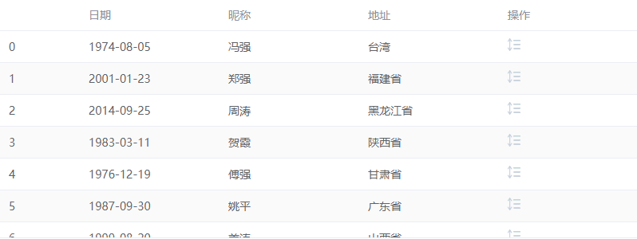

# 《关于表格拖拽行修改顺序的交互方式这件事》

> 这里是突然勤奋的 Zhuo，持续更新文档中。

## 需求

“小Z，我看到一个新的交互方式，在竞品上看到的，我们产品里也用上这个方式吧？” PO 如是说，然后打开竞品。

PO：“他们能实现，我们实现也没什么问题吧？”


我看着 PO 在竞品上来回拖拽表格行丝滑的展示，我的心也随即抽动。

“5 天工作量。”


## 效果


## 分析

1. 表格直接使用现有的表格组件就行了，这里用 `ElTable`作为案例
2. 拖拽部分的功能：
   - 利用 ` drag API ` 实现（偷懒不写demo ( ･´ω`･ ) ）
   - 通过第三方库（[SortableJS](http://www.sortablejs.com/)）实现（这个库还挺好用的，点击可查看文档）
3. 拖拽结束后，发送请求给后端

```vue
// 以上全部的代码实现
<script lang="ts" setup>
import { ElTable, ElTableColumn } from 'element-plus';
import Sortable from 'sortablejs';
import { onMounted, ref } from 'vue-demi';
import { tableData } from './data';

const data: Record<string, any>[] = tableData;

onMounted(() => {
    const tbody = document.querySelector('.el-table tbody');

    Sortable.create(tbody, {
        onEnd () {
            // 这里去发起请求
            // 刷新列表
        }
    });
});
</script>
```

整一个实现方式就是这样。


## 后续

上边我们实现了一个乞丐版本的拖拽功能，交付给到了 PO，PO也觉得挺不错，点赞、玫瑰、商业互吹中....

这个时候视觉设计师路过看到了这个功能，“小Z，你这个不行的，太丑了。要加点样式”。

于是，最后的效果



在这里提一句，效果图中，当拖拽到区域最上/下方会自行滚动的行为需要开启`forceFallback: true`该配置，如果配置了 `false`，就需要自己实现该行为。

## 最后
源代码：[Github](https://github.com/zhuoooo/draggable-demo)，如果有帮助，可以点个免费的 star 嘛。
